# JARKOM MODUL 1-2026-K-06

## Anggota Kelompok
|Nama|NRP|
|---|---|
|Dewa Ngakan Gede Wira Adhimukti|5027251063|
|Razana Aulia|5027251127|

## Laporan Praktikum 
### 1. Membangun The Wired
   
Untuk membangun The Wired, Lain (Router) harus membuat tiga Switch, dengan rincian:
   - Swith 1 menuju Alice dan Mika
   - Switch 2 menuju Chisa
   - Switch 3 menuju Knights dan Eiri

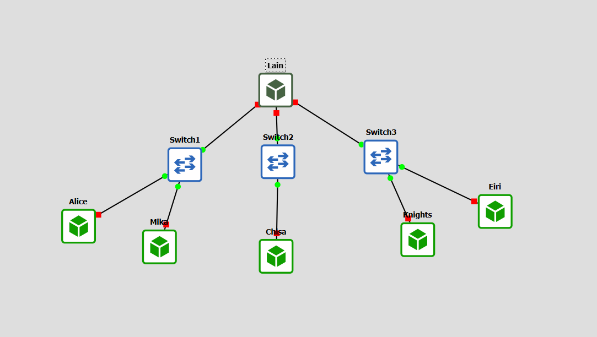

<break>

### 2 - Menghubungkan Lain ke Internet
Karena The Wired masih terisolasi dari dunia luar, router (Lain) harus dikonfigurasi agar dapat tersambung ke internet. Untuk itu, interface eth0 pada Lain harus dihubungkan dengan NAT. Interface tersebut kemudian dikonfigurasi sebagai DHCP client agar memperoleh alamat IP secara otomatis dari NAT.
   
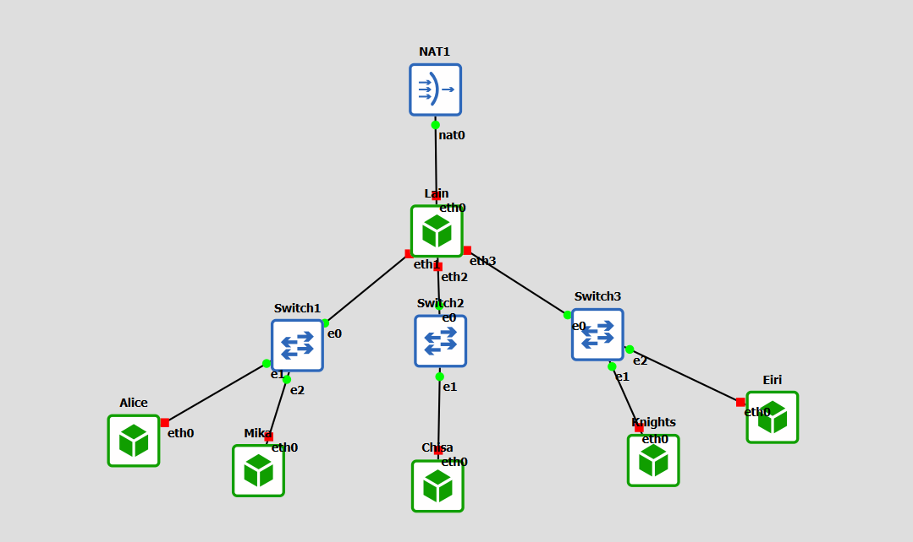

Konfigurasi yagn dimasukkan ke `/etc/network/interfaces` adalah sebagai berikut:

```
auto eth0
iface eth0 inet dhcp
        hostname alpinet-1
```

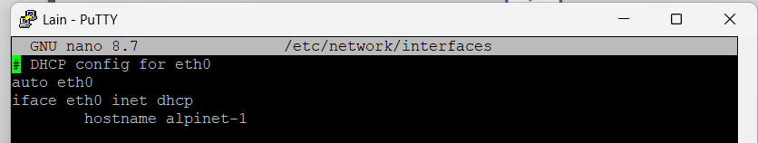

Konfigurasi `iface eth0 inet dhcp` membuat interface `eth0` menggunakan DHCP sehingga alamat IP dan konfigurasi jaringan dapat diperoleh secara otomatis dari NAT. Sementara itu, `auto eth0` memastikan interface tersebut diaktifkan secara otomatis ketika konfigurasi jaringan dijalankan.


Setelah konfigurasi diterapkan, dilakukan pengujian konektivitas menggunakan `ping` untuk memastikan bahwa Lain telah dapat terhubung ke jaringan luar.

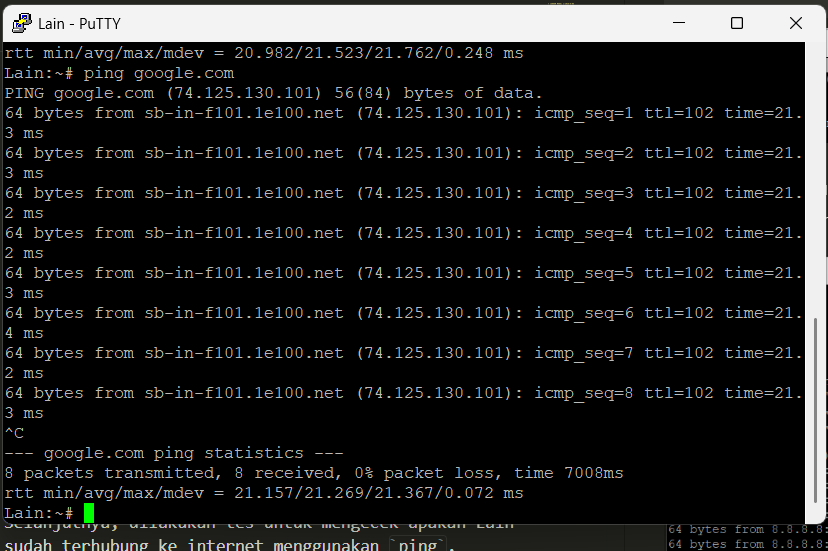

Tes menunjukkan bahwa Lain sudah berhasil terkoneksi dengan internet melalu NAT.

### 3 - Menghubungkan Sesama Client

Untuk membuat semua client dapat saling berkomunikasi, setiap jaringan client perlu memiliki gateway yang mengarah ke router Lain. Oleh karena itu, interface pada router Lain yang terhubung ke masing-masing switch dikonfigurasi menggunakan IP statis. IP tersebut nantinya akan digunakan sebagai default gateway oleh client pada jaringan masing-masing.

Prefix IP untuk kelompok 6 adalah `192.214.x.x`, sehingga pembagian IP untuk setiap switch adalah sebagai berikut:
- Switch 1: 192.214.1.1 (terhubung dengan eth1)
- Switch 2: 192.214.2.1 (terhubung dengan eth2)
- Switc 3: 192.214.3.1 (terhubung dengan eth3)

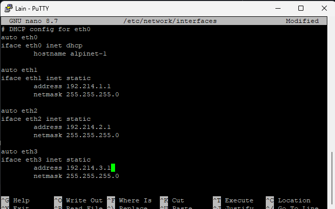

Setelah konfigurasi selesai, dilakukan tes menggunakan command `ip a ` untuk memastikan bahwa setiap interface telah memperoleh alamat IP sesuai dengan konfigurasi yang telah ditetapkan.

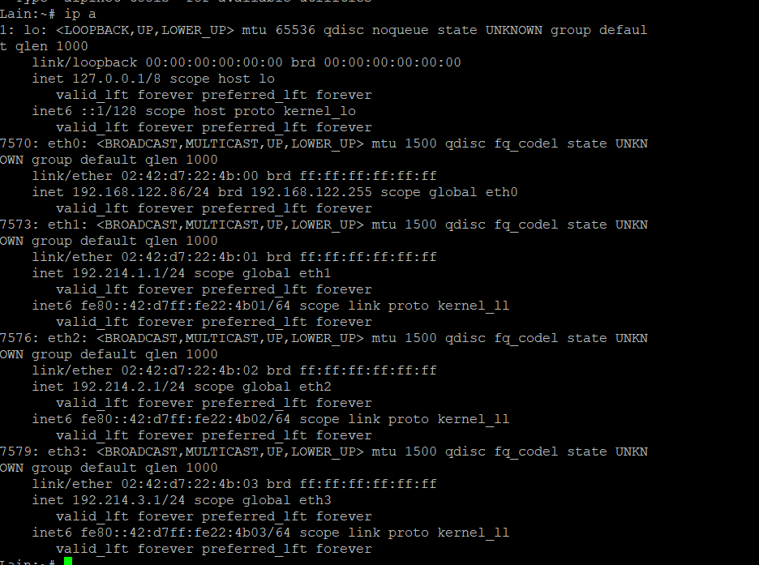

Hasil tes menunjukkan bahwa `eth1`, e`th2, dan `eth3` masing-masing telah memiliki alamat IP `192.214.1.1/24`, `192.214.2.1/24`, dan `192.214.3.1/24`, sehingga konfigurasi pada setiap interface router telah berhasil dilakukan.

Setelah switch dikonfigurasi, selanjutnya adalah memberikan alamat IP untuk setiap client sesuai dengan switch yang terhubung dengan mereka. Berikut adalah konfigurasi untuk setiap client:

- Alice

    ```bash
    auto eth0
    iface eth0 inet static
        address 192.214.1.2
        netmask 255.255.255.0
        gateway 192.214.1.1
    ```

    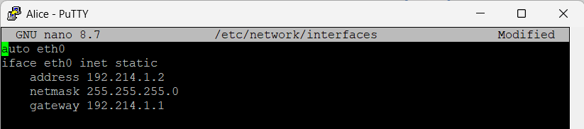


- Mika
  
    ```bash
    auto eth0
    iface eth0 inet static
        address 192.214.1.3
        netmask 255.255.255.0
        gateway 192.214.1.1
    ```
    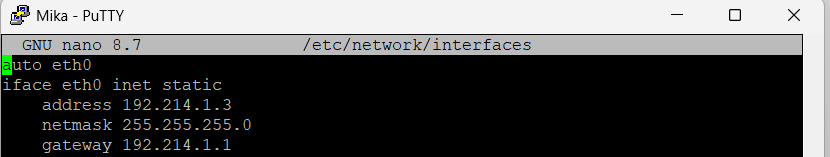

- Chisa

    ```bash
    auto eth0
    iface eth0 inet static
        address 192.214.2.2
        netmask 255.255.255.0
        gateway 192.214.2.1
    ```
    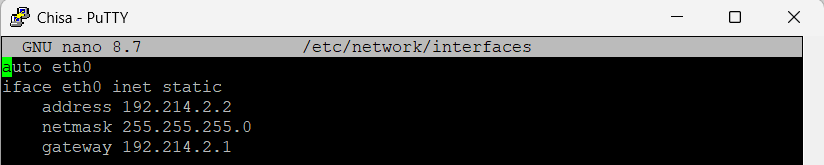

- Knights
    ```bash
    auto eth0
    iface eth0 inet static
        address 192.214.3.2
        netmask 255.255.255.0
        gateway 192.214.3.1
    ```

    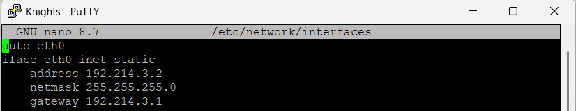

- Eiri
    ```bash
    auto eth0
    iface eth0 inet static
        address 192.214.3.3
        netmask 255.255.255.0
        gateway 192.214.3.1
    ```

    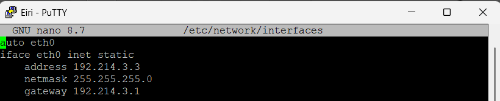

Selanjutnya akan dilakukan tes untuk melakukan ping antar-client.

- Alice
    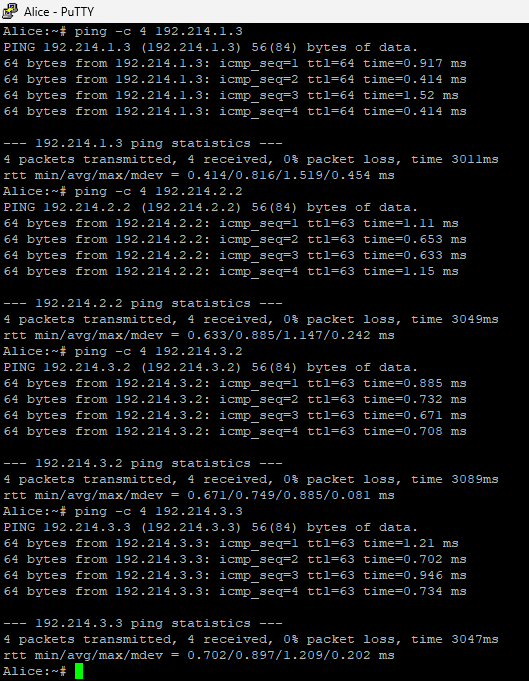

- Mika
    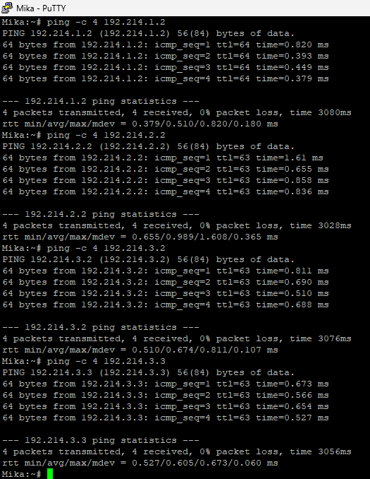
- Chisa
  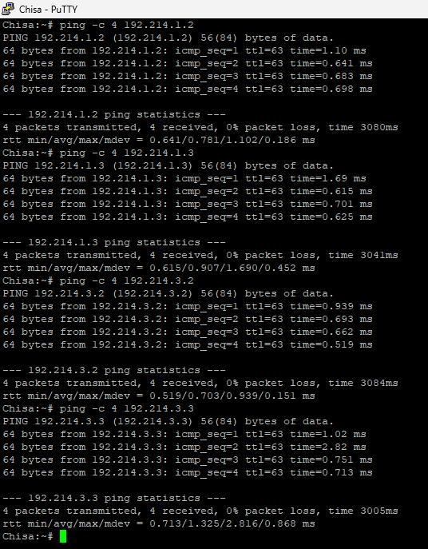
- Knights
  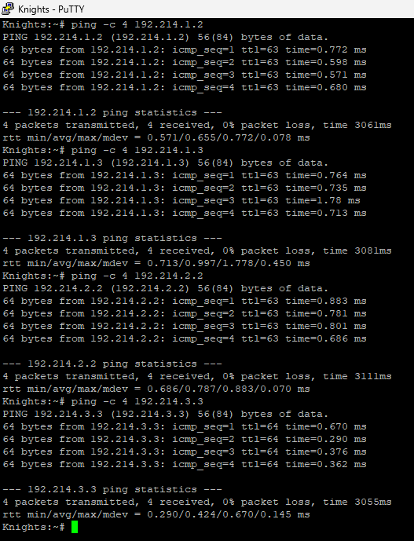
- Eiri
  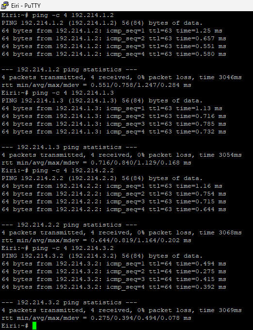

Hasil tes menunjukkan bahwa semua client sudah berhasil terhubung dan berkomunikasi satu sama lainnya.

### 4 Konfigurasi iptables dan DNS Resolver 

Lain ingin agar setiap Client dapat memiliki kemandirian di The Wired. Oleh karena itu, perlu dilakukan konfigurasi DNS resolver pada setiap client serta konfigurasi NAT dan IP forwarding pada router Lain agar setiap client dapat mengakses internet.

Pertama, dilakukan pengecekan terhadap nameserver yang diperoleh Lain dari NAT melalui file /etc/resolv.conf.

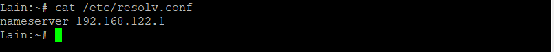

Berdasarkan hasil pengecekan, nameserver yang digunakan oleh Lain adalah `192.168.122.1`. IP tersebut kemudian ditambahkan ke file `/etc/resolv.conf` pada masing-masing client agar client dapat melakukan DNS resolution.

- Alice
  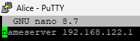

- Mika
  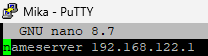
- Chisa
  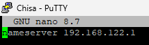
- Knights
  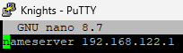
- Eiri
  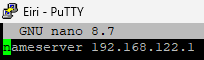

Setelah konfigurasi DNS resolver pada masing-masing client selesai, tahap selanjutnya adalah mengatur NAT pada router Lain menggunakan `iptables`. Pada node Lain, `iptables` telah tersedia sehingga tidak diperlukan instalasi tambahan. Rule NAT ditambahkan menggunakan command berikut:

Karena `iptables` secara bawaan sudah terinstal, maka langkah selanjutnya adalah menambahkan rule berikut ke NAT:

```bash
iptables -t nat -A POSTROUTING -o eth0 -j MASQUERADE -s 192.214.0.0/16
```
Rule tersebut melakukan Network Address Translation (NAT) terhadap paket yang berasal dari jaringan client `192.214.0.0/16` dan keluar melalui interface `eth0`. Opsi `MASQUERADE` akan mengganti source IP client dengan IP yang dimiliki oleh interface `eth0` pada Lain, sehingga paket dapat diteruskan menuju NAT dan internet.

Setelah konfigurasi NAT dibuat, Lain perlu diatur agar dapat meneruskan paket dari jaringan client menuju jaringan luar. Hal tersebut dilakukan dengan mengaktifkan IP forwarding menggunakan command:

```bash
echo 1 > /proc/sys/net/ipv4/ip_forward
```
Konfigurasi tersebut memungkinkan Lain berfungsi sebagai router yang meneruskan paket dari interface internal (`eth1`, `eth2`, dan `eth3`) menuju `eth0`.

Setelah semua hal di atas dilakukan, kemudian dicek apakah setiap client sudah berhasil terhubung ke internet atau belum dengan cara melakukan command`ping` ke google.com.

- Alice
  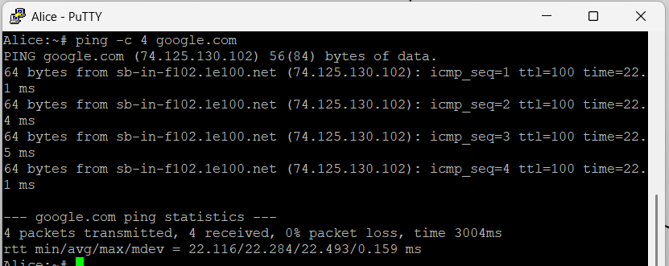
- Mika
  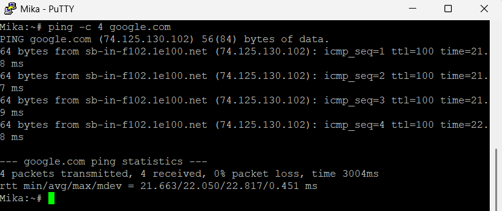
- Chisa
  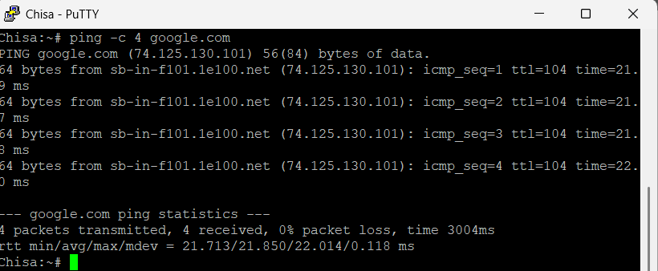
- Knights
  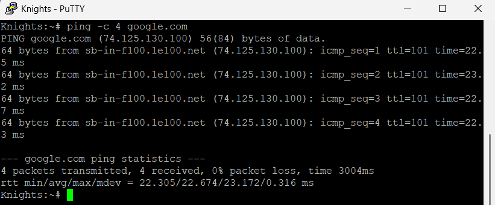
- Eiri
  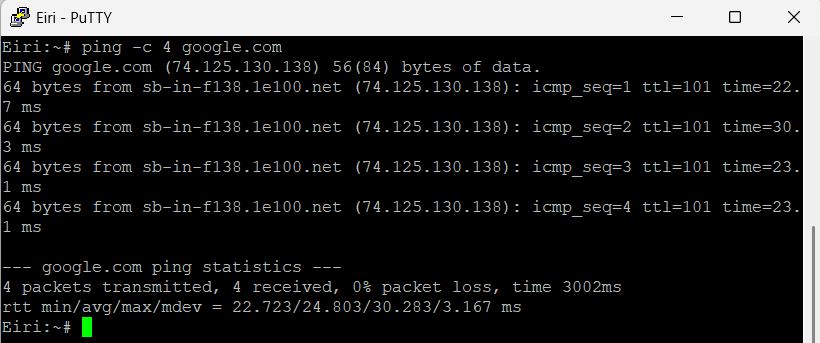
 
 Tes di atas menunjukkan bahwa setiap client berhasil memperoleh response dari google.com. Hal tersebut menunjukkan bahwa konfigurasi DNS resolver, NAT, dan IP forwarding telah berhasil sehingga setiap client dapat terhubung ke internet melalui router Lain.

 ### 5 - Setup Recovery Jaringan

Eiri terus berupaya menanamkan kekacauan ke dalam jaringan. Untuk itu, perlu dibuat agar konfigurasi jaringan tidak hilang saat semua node di-restart. Pada tahap ini, konfigurasi Router Lain terlebih dahulu dibuat agar dapat dipulihkan secara otomatis ketika node kembali dijalankan.

Konfigurasi alamat dan gateway interface disimpan pada `/etc/network/interfaces`. Sementara itu, IP forwarding dan rule NAT pada `iptables` merupakan konfigurasi runtime yang berada pada state kernel dan tabel firewall container, sehingga perlu diterapkan kembali ketika container dijalankan kembali.

Sebelum menentukan mekanisme untuk menjalankan konfigurasi tersebut secara otomatis, dilakukan pemeriksaan terhadap proses yang berjalan pada container Lain. Pemeriksaan dilakukan menggunakan command:

```bash
ps -o pid,ppid,args
```
Perintah tersebut digunakan untuk menampilkan Process ID (PID), Parent Process ID (PPID), dan argumen/perintah yang dijalankan oleh setiap proses.

Hasil pemeriksaan pada Router Lain adalah:

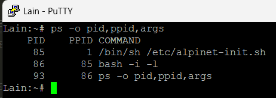

Berdasarkan hasil tersebut, dapat diketahui bahwa proses utama container menjalankan `/bin/sh /etc/alpinet-init.sh`dengan PID 83. Proses tersebut kemudian menjalankan Bash dengan PID 84 yakni bash `-i -l`. Parameter -i menunjukkan bahwa Bash dijalankan sebagai interactive shell, sedangkan parameter -l menunjukkan bahwa Bash dijalankan sebagai login shell.

Karena Bash pada container Lain dijalankan sebagai login shell, digunakan `/root/.bash_profile` sebagai file startup untuk menjalankan kembali konfigurasi yang diperlukan. Pada Bash, `.bash_profile` merupakan salah satu file startup yang dibaca ketika login shell dimulai. Oleh karena itu, konfigurasi IP forwarding dan NAT dapat ditempatkan di dalam file tersebut sehingga dijalankan kembali secara otomatis ketika Bash login dimulai.

File `/root/.bash_profile` kemudian diisi dengan:

```bash
cat > /root/.bash_profile <<'EOF'
#!/bin/bash

echo 1 > /proc/sys/net/ipv4/ip_forward

iptables -t nat -C POSTROUTING -o eth0 -s 192.214.0.0/16 -j MASQUERADE 2>/dev/null || \
iptables -t nat -A POSTROUTING -o eth0 -s 192.214.0.0/16 -j MASQUERADE
EOF
```

Untuk menguji apakah .bash_profile benar-benar dijalankan oleh login shell, dilakukan tes sederhana dengan cara menghapus rule pada NAT menggunakan command berikut.
```bash
iptables -t nat -D POSTROUTING -o eth0 -s 192.214.0.0/16 -j MASQUERADE
```

Kemudian dicek menggunakan command `iptables -t nat -L POSTROUTING -n -v` dan diperoleh hasil sebagai berikut.

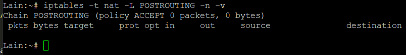

Pengecekan tabel NAT menunjukkan bahwa rule MASQUERADE sudah tidak tersedia

Lalu dibuat sesi Bash baru menggunakan mode interactive dan login dengan command berikut.

```bash
bash -i -l
```

Setelah Bash login dijalankan, tabel NAT diperiksa kembali dan diperoleh hasil sebagai berikut.

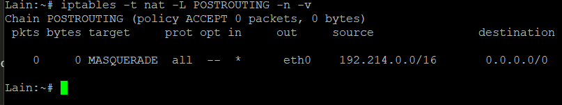

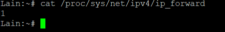

Hasilnya menunjukkan rule MASQUERADE kembali tersedia dan membuktikan bahwa konfigurasi pada `/root/.bash_profile` berhasil dijalankan ketika Bash login shell dimulai. IP forwarding juga diperiksa dan mengembalikan angka `1` yagn menandakan bahwa IP forwarding telah aktif.

Selanjutnya, akan dilakukan konfigurasi file `/root/.bash_profile` pada masing - masing client.

#### Alice
```bash
cat > /root/.bash_profile <<'EOF'
#!/bin/bash

cat > /etc/network/interfaces <<'NETEOF'
auto eth0
iface eth0 inet static
    address 192.214.1.2
    netmask 255.255.255.0
    gateway 192.214.1.1
NETEOF

echo "nameserver 192.168.122.1" > /etc/resolv.conf

ifup eth0 2>/dev/null || true
EOF
```

#### Mika
```bash
cat > /root/.bash_profile <<'EOF'
#!/bin/bash

cat > /etc/network/interfaces <<'NETEOF'
auto eth0
iface eth0 inet static
    address 192.214.1.3
    netmask 255.255.255.0
    gateway 192.214.1.1
NETEOF

echo "nameserver 192.168.122.1" > /etc/resolv.conf

ifup eth0 2>/dev/null || true
EOF
```

#### Chisa
```bash
cat > /root/.bash_profile <<'EOF'
#!/bin/bash

cat > /etc/network/interfaces <<'NETEOF'
auto eth0
iface eth0 inet static
    address 192.214.2.2
    netmask 255.255.255.0
    gateway 192.214.2.1
NETEOF

echo "nameserver 192.168.122.1" > /etc/resolv.conf

ifup eth0 2>/dev/null || true
EOF
```

#### Knights
```bash
cat > /root/.bash_profile <<'EOF'
#!/bin/bash

cat > /etc/network/interfaces <<'NETEOF'
auto eth0
iface eth0 inet static
    address 192.214.3.2
    netmask 255.255.255.0
    gateway 192.214.3.1
NETEOF

echo "nameserver 192.168.122.1" > /etc/resolv.conf

ifup eth0 2>/dev/null || true
EOF
```

#### Eiri
```bash
cat > /root/.bash_profile <<'EOF'
#!/bin/bash

cat > /etc/network/interfaces <<'NETEOF'
auto eth0
iface eth0 inet static
    address 192.214.3.3
    netmask 255.255.255.0
    gateway 192.214.3.1
NETEOF

echo "nameserver 192.168.122.1" > /etc/resolv.conf

ifup eth0 2>/dev/null || true
EOF
```

Pada scrip - script di atas, terdapat baris kode `ifup eth0 2>/dev/null || true`. Command `ifup eth0` digunakan untuk mengaktifkan interface berdasarkan konfigurasi pada `/etc/network/interfaces`. Penggunaan `2>/dev/null || true` berfungsi mencegah proses startup berhenti apabila interface sudah berada dalam kondisi aktif.

Selanjutnya, akan dibuat suatu script untuk melakukan verifikasi di `/root/cek_status.sh` pada router Lain. Script akan menampilkan  ringkasan interface (ip -br a) dan status tabel NAT (iptables -t nat -L -v -n) setelah reboot. Berikut adalah isi dari script tersebut:

```bash
cat > /root/cek_status.sh <<'EOF'
#!/bin/sh

echo "===== STATUS INTERFACE ====="
ip -br a

echo
echo "===== STATUS NAT ====="
iptables -t nat -L -v -n
EOF

chmod +x /root/cek_status.sh
```

 Validasi dilakukan melalui dua parameter  utama. Command `ip -br a` berfungsi untuk memastikan seluruh interface jaringan beserta alokasi alamat IP-nya tetap aktif dan terkonfigurasi dengan benar. Command iptables -t nat -L -v -n digunakan untuk mengonfirmasi keberadaan dan konfigurasi rule NAT pada tabel NAT. 

### 6 - Display Filter

Mika mencurigai adanya anomali traffic pada segmen jaringannya. Jalankan generator traffic pada node Mika, lalu lakukan packet sniffing menggunakan Wireshark pada interface node Mika. Terapkan display filter khusus untuk menyaring paket yang berprotokol DNS atau ICMP. Tunjukkan screenshot hasil filter beserta ringkasan paket yang lolos.

Pertama, file harus didownload dan di-unzip terlebih dahulu di dalam node Mika.

```bash
gdown --folder "https://drive.google.com/drive/folders/1ZjFvWIjvAQAjE9pPthm7V_bGyaSt93lY?usp=sharing" -O traffic

cd traffic/
unzip traffic_protocol7.zip
```


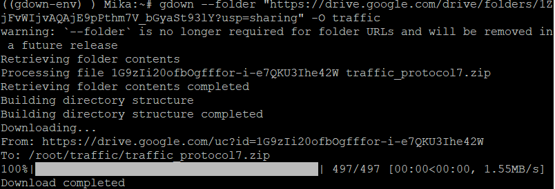

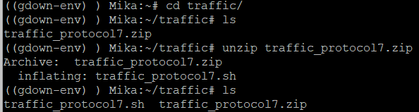

Setelah file diunduh dan diekstrak, ditemukan file bernama `traffic_protocol7.sh`. Setelah itu, file dijalankan di dalam node Mika dengan cara:

```bash
bash traffic_protocol7.shh
```

File lalu akan membanjiri jaringan di node Mika dengan banyak paket. Untuk mengecek paket yang masuk menggunakan wireshark, digunakan caputring antara connecting line Mika dan switch 1.

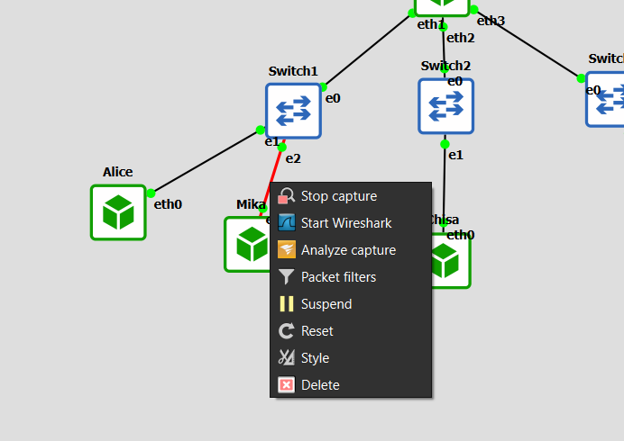

Di dalam wireshark akan terlihat jelas semua paket yang masuk tadi. 

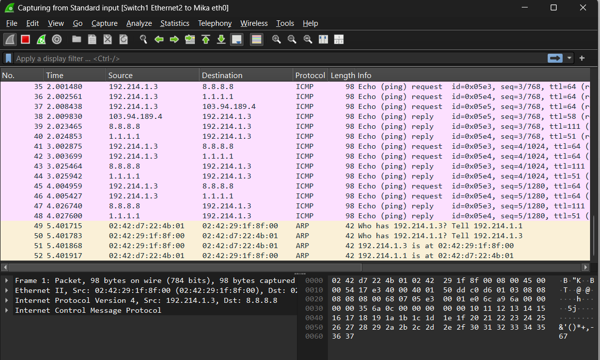

Gambar menunjukkan sesi capture Wireshark pada interface `Switch1 Ethernet2 to Mika eth0 `tanpa display filter aktif, sehingga seluruh jenis protokol tertampil apa adanya. Paket yang terlihat didominasi oleh traffic ICMP berupa aktivitas ping berulang dari host `192.214.1.3` ke dua tujuan yaitu `8.8.8.8` (Google DNS) dan `1.1.1.1` (Cloudflare), dengan sequence number yang terus bertambah mulai dari seq 3/768 hingga seq 5/1280 dan semua mendapat balasan *reply* yang sukses. Di penghujung capture, muncul empat paket ARP pada timestamp sekitar 5.40 detik, di mana dua perangkat dengan MAC `02:42:d7:22:4b:01` dan `02:42:29:1f:8f:00` saling bertukar informasi untuk memetakan alamat IP `192.214.1.3` dan `192.214.1.1` ke alamat MAC masing-masing, yang merupakan proses resolusi alamat yang umum terjadi di jaringan lokal.

Untuk  menyaring paket yang berprotokol DNS atau ICMP, cukup mengetikkan `dns || icmp` pada display filter, sehingga diperoleh hasil sebagai berikut:

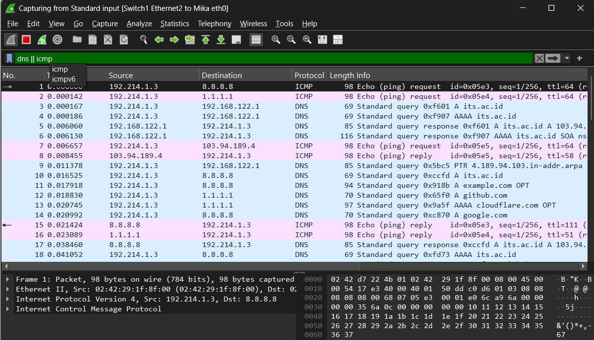

Wireshark hanya menampilkan paket yang termasuk protokol DNS atau ICMP, menyembunyikan seluruh traffic lain seperti ARP, TCP, maupun protokol lainnya dari tampilan. Dari keseluruhan sesi capture, terdapat 18 paket yang berhasil lolos filter — terdiri dari 10 paket DNS dan 8 paket ICMP.

Paket DNS mencakup query tipe A dan AAAA ke beberapa domain seperti its.ac.id, github.com, cloudflare.com, dan google.com, dengan DNS server yang digunakan meliputi resolver lokal 192.168.122.1, Google 8.8.8.8, dan Cloudflare 1.1.1.1. Sementara itu, paket ICMP merekam aktivitas ping ke tiga tujuan berbeda yaitu 8.8.8.8, 1.1.1.1, dan 103.94.189.4 (IP hasil resolusi its.ac.id) yang semuanya berhasil mendapatkan reply, secara langsung menunjukan konektivitas jaringan dalam kondisi baik selama sesi capture berlangsung.

### 7 - Membuat Server FTP

Chisa memutuskan mendirikan FTP Server pada node miliknya dengan menggunakan /`var/wired/data sebagai shared folder`. Sebelum melakukan konfigurasi, package vsftpd perlu di-install terlebih dahulu dengan perintah berikut:

```bash
apk add vsftpd
```

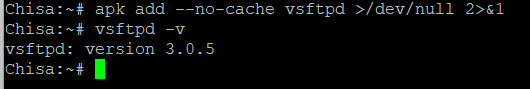

Setelah package FTP terpasang,` /sbin/nologin` didaftarkan ke `/etc/shells`. Shell ini digunakan pada akun FTP agar user dapat digunakan untuk autentikasi FTP tanpa memberikan akses ke interactive shell pada sistem.

```bash
grep -qxF "/sbin/nologin" /etc/shells || echo "/sbin/nologin" >> /etc/shells
```

Selanjutnya dibuat direktori `/var/wired/data` yang akan digunakan sebagai shared folder untuk menyimpan file yang dapat diakses melalui FTP. Variabel `SHARED` digunakan agar path tersebut dapat digunakan kembali pada konfigurasi user berikutnya.

```bash
SHARED="/var/wired/data"
mkdir -p "$SHARED"
```

Setelah server dan shared folder disiapkan, selanjutnya dibuat tiga user yang akan digunakan untuk autentikasi FTP, yaitu `alice`, `mika`, dan `eiri`.

```bash
id alice >/dev/null 2>&1 || adduser -D -h "$SHARED" -s /sbin/nologin alice
echo "alice:alice123" | chpasswd

id mika >/dev/null 2>&1 || adduser -D -h "$SHARED" -s /sbin/nologin mika
echo "mika:mika123" | chpasswd

id eiri >/dev/null 2>&1 || adduser -D -h "$SHARED" -s /sbin/nologin eiri
echo "eiri:eiri123" | chpasswd
```
Setiap user diberikan password dengan pola nama user diikuti 123, yaitu `alice123`, `mika123`, dan `eiri123`.

Setelah user dibuat, home directory ketiga user dipastikan mengarah ke /var/wired/data. Pada Alpine Linux, perubahan ini dilakukan dengan memperbarui entry user pada /etc/passwd karena utilitas usermod tidak tersedia secara default.

```bash
sed -i 's|^alice:.*$|alice:x:1000:1000::/var/wired/data:/sbin/nologin|' /etc/passwd 
sed -i 's|^mika:.*$|mika:x:1001:1001::/var/wired/data:/sbin/nologin|' /etc/passwd 
sed -i 's|^eiri:.*$|eiri:x:1002:1002::/var/wired/data:/sbin/nologin|' /etc/passwd
```

Konfigurasi tersebut memastikan ketiga user memiliki /var/wired/data sebagai home directory dan tetap menggunakan /sbin/nologin sebagai shell.

Selanjutnya adalah membuat hak akses untuk tiap user seusai dengan ketentuan berikut:
- Alice: read & write
- Mika: read-only
- Eiri: blacklist/tidak memiliki akses FTP

Sebelum itu, kita perlu mengatur permission shared folder secara langsung di filesystem linux dengan cara:

```bash
chown alice:alice "$SHARED"
chmod 755 "$SHARED"
```

Perintah tersebut menjadikan Alice sebagai pemilik shared folder dan memberikan permission `rwx` kepada owner serta` r-x` kepada user lainnya. Dengan demikian, Alice memiliki hak untuk membaca dan menulis pada folder, sedangkan user lainnya hanya memiliki akses untuk membaca isi folder dan masuk ke dalamnya.

Selanjutnya dilakukan konfigurasi untuk vsftpd dengan cara berikut:

```bash
cat > /etc/vsftpd/vsftpd.conf <<'CFG'
listen=YES
listen_ipv6=NO
listen_address=0.0.0.0
anonymous_enable=NO
local_enable=YES
write_enable=YES
chroot_local_user=YES
allow_writeable_chroot=YES
user_config_dir=/etc/vsftpd_users
userlist_enable=YES
userlist_deny=NO
userlist_file=/etc/vsftpd.user_list
seccomp_sandbox=NO
CFG
```
Konfigurasi tersebut mengaktifkan akses FTP menggunakan akun lokal dan menonaktifkan anonymous login sehingga setiap koneksi harus menggunakan akun yang telah dibuat. `listen_address=0.0.0.0` membuat server menerima koneksi FTP melalui seluruh interface IPv4. `chroot_local_user` membatasi user agar tetap berada di dalam direktori home-nya, sedangkan `user_config_dir` digunakan untuk menerapkan konfigurasi yang berbeda pada masing-masing user. Selain itu, `userlist_enable=YES` dan `userlist_deny=NO` membuat `/etc/vsftpd.user_list `berfungsi sebagai allowlist yang menentukan user mana yang diperbolehkan melakukan login ke FTP. `seccomp_sandbox=NO` digunakan agar vsftpd dapat berjalan dengan baik di Alpine Linux.


Kemudian ditentukan user mana saja yang diperbolehkan untuk melakukan login.

```bash
cat > /etc/vsftpd.user_list <<'USERS'
alice
mika
USERS
```
File tersebut berisi daftar user yang diizinkan untuk melakukan login ke FTP karena konfigurasi menggunakan `userlist_deny=NO`. Alice dan Mika dimasukkan ke dalam daftar, sedangkan Eiri tidak dimasukkan sehingga percobaan login menggunakan akun Eiri akan ditolak.

Selanjutnya dibuat konfigurasi khusus untuk masing-masing user melalui direktori `/etc/vsftpd_users`.

```bash
mkdir -p /etc/vsftpd_users

cat > /etc/vsftpd_users/alice <<'ALICE'
local_root=/var/wired/data
write_enable=YES
ALICE

cat > /etc/vsftpd_users/mika <<'MIKA'
local_root=/var/wired/data
write_enable=NO
MIKA
```

Direktori `/etc/vsftpd_users` digunakan untuk menyimpan konfigurasi khusus masing-masing user. Alice diberikan `write_enable=YES` sehingga dapat melakukan operasi baca dan tulis, sedangkan Mika diberikan `write_enable=NO` sehingga akses tulis melalui FTP dinonaktifkan dan Mika hanya dapat membaca file.


Terakhir, server perlu dijalankan dengan cara berikut:

```bash
vsftpd /etc/vsftpd/vsftpd.conf &
ps | grep vsftpd
```
Setelah seluruh konfigurasi selesai, `vsftpd` dijalankan menggunakan file konfigurasi yang telah dibuat. Selanjutnya dilakukan pemeriksaan proses untuk memastikan `vsftpd` telah berjalan dan siap menerima koneksi FTP dari client.

Semua hal tadi dapat dijalankan secara langsung melalui satu script, di sini kami memasukkannya ke dalam script setup_ftp.sh.

- setup_ftp.sh
```bash
#!/bin/bash

# Install vsftpd jika belum ada
apk add --no-cache vsftpd >/dev/null 2>&1

# Daftarkan shell nologin untuk akun FTP
grep -qxF "/sbin/nologin" /etc/shells || echo "/sbin/nologin" >> /etc/shells

# Shared folder
SHARED="/var/wired/data"
mkdir -p "$SHARED"

# Buat user FTP jika belum ada
id alice >/dev/null 2>&1 || adduser -D -h "$SHARED" -s /sbin/nologin alice
echo "alice:alice123" | chpasswd

id mika >/dev/null 2>&1 || adduser -D -h "$SHARED" -s /sbin/nologin mika
echo "mika:mika123" | chpasswd

id eiri >/dev/null 2>&1 || adduser -D -h "$SHARED" -s /sbin/nologin eiri
echo "eiri:eiri123" | chpasswd

# Pastikan home directory setiap user adalah shared folder
sed -i 's|^alice:.*$|alice:x:1000:1000::/var/wired/data:/sbin/nologin|' /etc/passwd
sed -i 's|^mika:.*$|mika:x:1001:1001::/var/wired/data:/sbin/nologin|' /etc/passwd
sed -i 's|^eiri:.*$|eiri:x:1002:1002::/var/wired/data:/sbin/nologin|' /etc/passwd

# Permission shared folder
chown alice:alice "$SHARED"
chmod 755 "$SHARED"

# Konfigurasi utama vsftpd
cat > /etc/vsftpd/vsftpd.conf <<'CFG'
listen=YES
listen_ipv6=NO
listen_address=0.0.0.0
anonymous_enable=NO
local_enable=YES
write_enable=YES
chroot_local_user=YES
allow_writeable_chroot=YES
user_config_dir=/etc/vsftpd_users
userlist_enable=YES
userlist_deny=NO
userlist_file=/etc/vsftpd.user_list
seccomp_sandbox=NO
CFG

# User yang diizinkan login FTP
cat > /etc/vsftpd.user_list <<'USERS'
alice
mika
USERS

# Konfigurasi per-user
mkdir -p /etc/vsftpd_users

cat > /etc/vsftpd_users/alice <<'ALICE'
local_root=/var/wired/data
write_enable=YES
ALICE

cat > /etc/vsftpd_users/mika <<'MIKA'
local_root=/var/wired/data
write_enable=NO
MIKA

# Jalankan vsftpd jika belum berjalan
killall vsftpd 2>/dev/null || true
vsftpd /etc/vsftpd/vsftpd.conf &
```

Setelah semua konfigurasi selesai, langkah terakhir yaitu membuktikan bahwa semua konfigurasi yagn sudah dibuat berjalan seperti seharusnya. Pengujian yang akan dilakukan yaitu:
- Alice membuat signal_alice.txt dan meng-upload ke FTP Chisa.
- Eiri mencoba login ke FTP Chisa dan ditolak.

Pertama, dilakukan pengujian dengan mengupload file dari Alice ke FPT Chisa.
```bash
touch signal_alice.txt
echo "Signal from Alice" > signal_alice.txt

lftp -u alice,alice123 192.214.2.2

put signal_alice.txt
exit
```
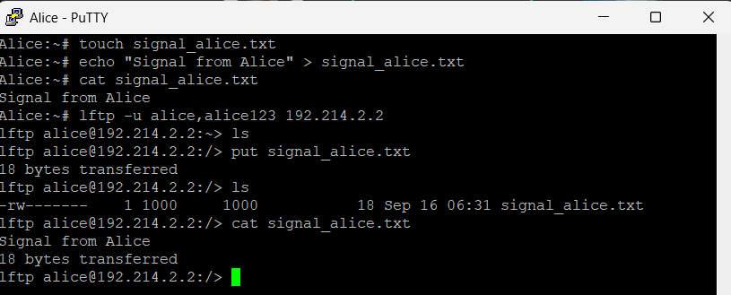

Selanjutnya dilakukan verifikasi pada server FTP milik Chisa.

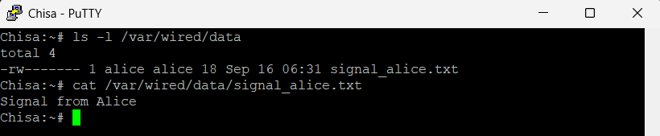

Hasil tersebut menunjukkan bahwa `signal_alice.txt` berhasil tersimpan pada shared folder, sehingga dapat dibuktikan bahwa user `alice` memiliki hak akses read & write.

Eiri
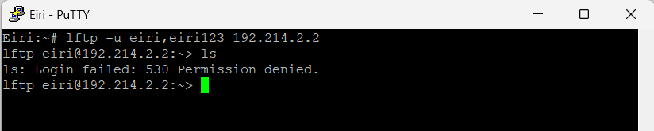

Pesan `530 Permission denied` menunjukkan bahwa autentikasi FTP untuk user eiri ditolak oleh server. Hal tersebut terjadi karena konfigurasi menggunakan `userlist_deny=NO`, sehingga hanya user yang tercantum pada `/etc/vsftpd.user_list`, yaitu alice dan mika, yang diizinkan melakukan login ke FTP Server.

### 8 - Pengiriman File dari Knights ke FTP Server Chisa

Kelompok rahasia Knights perlu mengirimkan dokumen laporan intelijen ke FTP Server Chisa. Lakukan koneksi FTP client dari node Knights ke FTP Server Chisa menggunakan akun alice. Analisis sesi Wireshark dan sebutkan: perintah FTP untuk upload (STOR), kode status sukses server (226), dan port data TCP yang dinegosiasikan pada mode PASV.

Pertama, file harus didownload dan di-unzip terlebih dahulu di dalam node Knights.

```bash
gdown "https://drive.google.com/file/d/1lFepK4wFmx55PnRki3NsHW-ivudSR0vg/view?usp=drive_link" -O laporan

unzip traffic
```

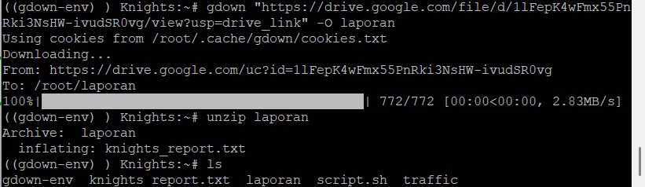

Setelah file didownlaod dan di-unzip, ditemukan 1 file baru yakni `knights_report.txt`. File `knights_report` adalah dokumen laporan intelijen yang akan dikirimkan ke FTP Server Chisa,

Setelah file tersedia, node Knights melakukan koneksi ke FTP Server Chisa menggunakan akun `alice`. Alamat IP FTP Server Chisa adalah `192.214.2.2`.

```bash
lftp -u alice,alice123 192.214.2.2
```
Setelah berhasil terhubung, passive mode diaktifkan menggunakan perintah berikut:

```
set ftp:passive-mode true
```
Perintah tersebut digunakan untuk memastikan client menggunakan FTP Passive Mode (PASV) dalam membangun koneksi data. Pada mode ini, client meminta server menentukan port yang akan digunakan untuk koneksi data.

Setelah koneksi FTP berhasil dibuat, file` knights_report.txt` dikirimkan ke server menggunakan perintah `put`.

```
put knights_report.txt
```

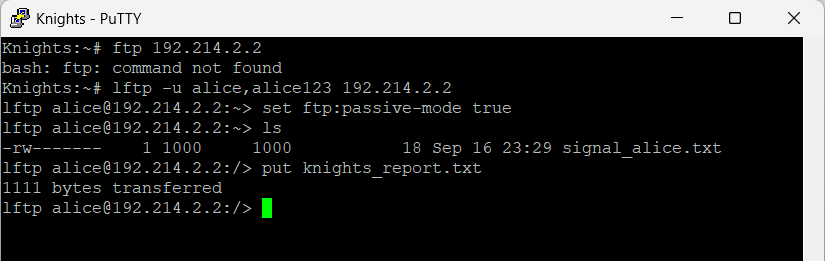

Berdasarkan hasil pada terminal, proses transfer `knights_report.txt` berhasil dilakukan dari node Knights menuju FTP Server Chisa. Untuk memastikan bahwa file benar-benar telah tersimpan pada server, dilakukan verifikasi secara langsung pada node Chisa.

```bash
ls -lh /var/wired/data
```
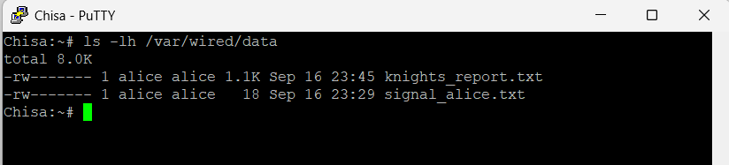

Hasil verifikasi menunjukkan bahwa file `knights_report.txt` telah terdapat di dalam direktori `/var/wired/data` pada node Chisa. Hal tersebut membuktikan bahwa file yang dikirim dari Knights berhasil diterima dan disimpan oleh FTP Server.


Selama proses transfer berlangsung, trafik jaringan antara Knights dan FTP Server Chisa ditangkap menggunakan Wireshark. Capture kemudian dianalisis untuk mengidentifikasi tahapan komunikasi FTP, khususnya proses negosiasi passive mode dan transfer file.

Hasil wireshark
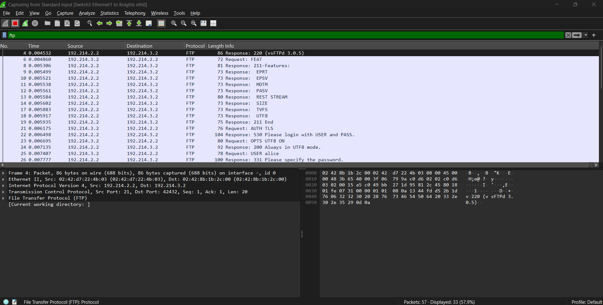
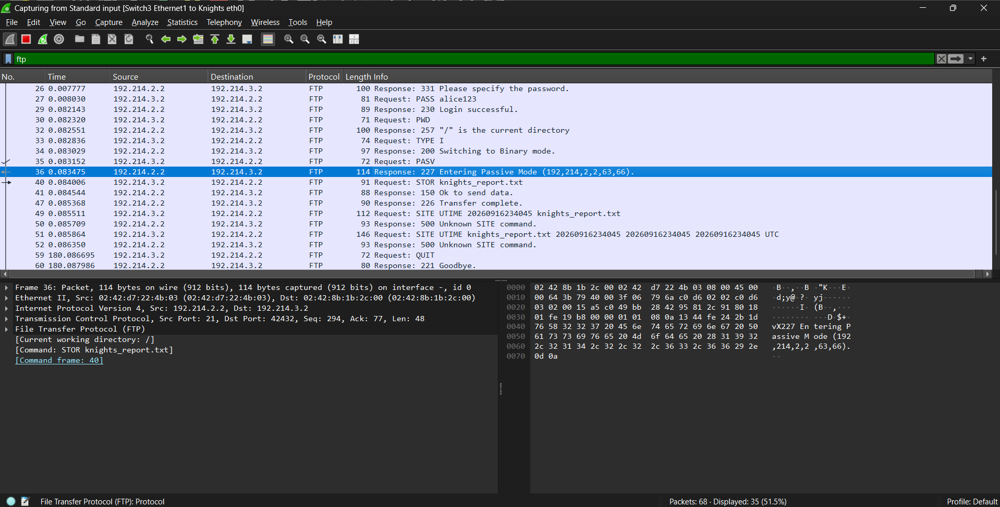

Analisis trafik dilakukan menggunakan Wireshark pada koneksi antara node Knights sebagai FTP Client dengan node Chisa sebagai FTP Server. Node Knights menggunakan alamat IP `192.214.3.2`, sedangkan FTP Server Chisa menggunakan alamat IP `192.214.2.2`. Koneksi dilakukan menggunakan akun `alice` untuk mengunggah file `knights_report.txt`.

Berdasarkan hasil packet capture, sesi FTP diawali ketika client Knights terhubung ke FTP Server Chisa. Server memberikan response 220 yang menunjukkan bahwa layanan FTP tersedia dan server siap menerima koneksi. Selanjutnya terjadi proses negosiasi fitur melalui perintah `FEAT` dengan response 211. Client juga mencoba menggunakan `AUTH TLS`, tetapi server memberikan response 530, sehingga koneksi dilanjutkan menggunakan FTP tanpa enkripsi TLS.

Proses autentikasi kemudian dilakukan menggunakan perintah `USER alice`, yang diikuti response 331 dari server untuk meminta password. Client mengirimkan password `alice123` melalui perintah `PASS`, kemudian server memberikan response 230, yang menunjukkan bahwa autentikasi berhasil. Setelah berhasil login, client menjalankan perintah `PWD` dan `TYPE I` untuk mengetahui direktori aktif serta menggunakan mode transfer binary.


Pada paket No. 40 terlihat perintah:

```text
Request: STOR knights_report.txt
```

Perintah tersebut dikirim dari `192.214.3.2` sebagai client menuju `192.214.2.2` sebagai server. Perintah `STOR` digunakan dalam FTP untuk meminta server menyimpan data yang dikirim oleh client sebagai sebuah file. Dalam sesi ini, file yang dikirim adalah `knights_report.txt`, sehingga paket tersebut menjadi bukti bahwa proses upload dilakukan dari node Knights ke FTP Server Chisa.


Sebelum proses upload, client menggunakan passive mode dengan mengirimkan perintah `PASV`. Pada paket No. 36, server memberikan response:

```text
227 Entering Passive Mode (192,214,2,2,63,66)
```

Response tersebut menunjukkan bahwa server FTP meminta client menggunakan koneksi data pada alamat `192.214.2.2` dengan port yang ditentukan oleh dua nilai terakhir, yaitu `p1 = 63` dan `p2 = 66`.

Port TCP data dihitung menggunakan formula:

```text
Port = (p1 × 256) + p2
      = (63 × 256) + 66
      = 16.194
```

Dengan demikian, port TCP data yang dinegosiasikan pada passive mode adalah 16.194. Port tersebut digunakan untuk koneksi data FTP yang terpisah dari koneksi control FTP.


Setelah perintah `STOR` dikirim dan data file ditransfer, server memberikan response pada paket No. 47:

```text
Response: 226 Transfer complete.
```

Kode status 226 menunjukkan bahwa koneksi data telah ditutup dan operasi transfer file telah berhasil diselesaikan. Dengan demikian, response ini menjadi bukti dari sisi server bahwa proses upload `knights_report.txt` telah selesai.

Berdasarkan hasil capture, keseluruhan sesi FTP dapat diringkas sebagai berikut:

```text
Knights (192.214.3.2)
        │
        │ Connect
        ▼
Chisa FTP Server (192.214.2.2)
        │
        ├── 220 Service ready
        ├── FEAT → 211
        ├── AUTH TLS → 530
        ├── USER alice → 331
        ├── PASS alice123 → 230
        ├── PWD → 257
        ├── TYPE I → 200
        ├── PASV → 227
        │      └── Data Port = 16.194
        │
        ├── STOR knights_report.txt
        │      └── File ditransfer melalui koneksi data
        │
        ├── 226 Transfer complete
        └── QUIT → 221
```

Dari hasil analisis tersebut dapat disimpulkan bahwa node Knights berhasil melakukan upload `knights_report.txt` ke FTP Server Chisa menggunakan akun `alice`. Tiga informasi utama yang diperoleh dari packet capture adalah perintah `STOR knights_report.txt` sebagai indikasi proses upload, response `226 Transfer complete` sebagai indikasi transfer berhasil, serta port TCP 16.194 yang dinegosiasikan server melalui response `227` pada passive mode.

### 9 - Akses Dokumen Protokol Tujuh oleh Mika

Mika mengakses dokumen Protokol Tujuh dari FTP Server Chisa. Dari node Mika, unduh file tersebut menggunakan akun mika. Setelah itu, buktikan pembatasan read-only dengayahn mencoba mengunggah file baru dari akun mika, dan tunjukkan pesan error respon server (error 550 Permission denied) saat mika mencoba melakukan upload.

Pertama-tama, file Protokol Tujuh perlu diunduh terlebih dahulu dan diletakkan pada server FTP Chisa. Oleh karena itu, proses pengunduhan file dilakukan melalui node Chisa menggunakan command berikut.

```bash
wget --no-check-certificate \
"https://drive.google.com/uc?export=download&id=1tKZu0rcti4t-fXX4jtXDSKDBWzsawfoN" \
-O Protokol_Tujuh.zip

unzip Protokol_Tujuh
```


Setelah proses ekstraksi selesai, didapatkan file `protocol7_manifesto.txt`. Selanjutnya, file tersebut dipindahkan ke dalam direktori yang digunakan sebagai folder server FTP Chisa, yaitu `/var/wired/data/`.

```bash
 cp protocol7_manifesto.txt /var/wired/data/
```

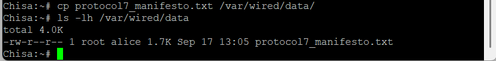

File berhasil dipindahkan ke dalam folder server FTP.

Selanjutnya dilakukan pengujian akses read menggunakan node Mika. Mika melakukan koneksi ke FTP Server Chisa menggunakan akun mika, kemudian mengunduh file `protocol7_manifesto.txt`.

```bash
lftp -u mika,mika123 192.214.2.2
get protocol7_manifesto.txt

```

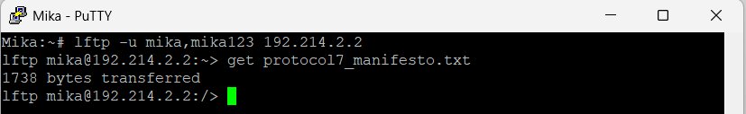

File berhasil diunduh oleh Mika. Hal ini menunjukkan bahwa akun mika memiliki hak akses `read` terhadap file pada FTP Server Chisa.

Selanjutnya dilakukan pengujian terhadap hak akses `write`. Mika membuat sebuah file baru bernama `test_mika.txt`, kemudian mencoba mengunggahnya ke FTP Server Chisa menggunakan perintah `put`.

```bash
echo "Test  Mika" > test_mika.txt
 put test_mika.txt
```

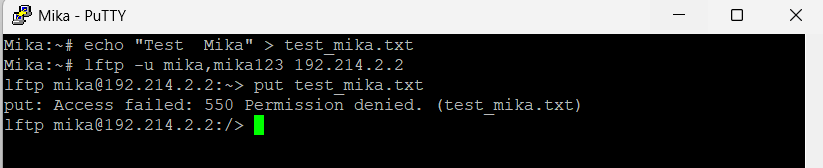

Upload file ditolak oleh FTP Server dengan pesan `550 Permission denied`. Hal ini menunjukkan bahwa akun mika tidak memiliki hak akses write, sehingga akun tersebut hanya dapat membaca atau mengunduh file dari FTP Server Chisa.

### 10 - Uji Ketahanan Koneksi Knights ke Server Chisa

Knights melancarkan uji ketahanan koneksi ke server Chisa untuk menguji latensi jaringan The Wired. Kirimkan paket ping dari node Knights ke node Chisa dengan payload khusus 128 bytes dan interval 0.3 detik sebanyak 77 paket (ping -c 77 -s 128 -i 0.3 <IP_Chisa>). Buka Wireshark, catat nilai ICMP Type dan Code untuk Echo Request vs Echo Reply, serta analisis packet loss dan RTT (min/avg/max).

Untuk melakukan pengujian tersebut, cukup menjalankan command berikut:

```bash
ping -c 77 -s 128 -i 0.3 192.214.2.2
```
Parameter `-c 77` digunakan untuk menentukan jumlah paket yang dikirim sebanyak 77 paket, -s 128 menentukan ukuran payload ICMP sebesar 128 bytes, sedangkan `-i 0.3` menentukan interval pengiriman antar-paket sebesar 0,3 detik. Alamat `192.214.2.2` merupakan alamat IP node Chisa.

Diperoleh hasil ping sebagai berikut:

```bash
Knights:~# ping -c 77 -s 128 -i 0.3 192.214.2.2
PING 192.214.2.2 (192.214.2.2) 128(156) bytes of data.
136 bytes from 192.214.2.2: icmp_seq=1 ttl=63 time=1.03 ms
136 bytes from 192.214.2.2: icmp_seq=2 ttl=63 time=0.700 ms
136 bytes from 192.214.2.2: icmp_seq=3 ttl=63 time=0.881 ms
136 bytes from 192.214.2.2: icmp_seq=4 ttl=63 time=0.655 ms
136 bytes from 192.214.2.2: icmp_seq=5 ttl=63 time=0.730 ms
136 bytes from 192.214.2.2: icmp_seq=6 ttl=63 time=0.854 ms
136 bytes from 192.214.2.2: icmp_seq=7 ttl=63 time=0.823 ms
136 bytes from 192.214.2.2: icmp_seq=8 ttl=63 time=0.966 ms
136 bytes from 192.214.2.2: icmp_seq=9 ttl=63 time=0.837 ms
136 bytes from 192.214.2.2: icmp_seq=10 ttl=63 time=0.469 ms
136 bytes from 192.214.2.2: icmp_seq=11 ttl=63 time=0.464 ms
136 bytes from 192.214.2.2: icmp_seq=12 ttl=63 time=0.422 ms
136 bytes from 192.214.2.2: icmp_seq=13 ttl=63 time=0.408 ms
136 bytes from 192.214.2.2: icmp_seq=14 ttl=63 time=0.672 ms
136 bytes from 192.214.2.2: icmp_seq=15 ttl=63 time=0.459 ms
136 bytes from 192.214.2.2: icmp_seq=16 ttl=63 time=0.433 ms
136 bytes from 192.214.2.2: icmp_seq=17 ttl=63 time=0.519 ms
136 bytes from 192.214.2.2: icmp_seq=18 ttl=63 time=0.480 ms
136 bytes from 192.214.2.2: icmp_seq=19 ttl=63 time=0.272 ms
136 bytes from 192.214.2.2: icmp_seq=20 ttl=63 time=0.476 ms
136 bytes from 192.214.2.2: icmp_seq=21 ttl=63 time=0.442 ms
136 bytes from 192.214.2.2: icmp_seq=22 ttl=63 time=0.452 ms
136 bytes from 192.214.2.2: icmp_seq=23 ttl=63 time=0.446 ms
136 bytes from 192.214.2.2: icmp_seq=24 ttl=63 time=0.461 ms
136 bytes from 192.214.2.2: icmp_seq=25 ttl=63 time=0.413 ms
136 bytes from 192.214.2.2: icmp_seq=26 ttl=63 time=0.445 ms
136 bytes from 192.214.2.2: icmp_seq=27 ttl=63 time=0.455 ms
136 bytes from 192.214.2.2: icmp_seq=28 ttl=63 time=0.488 ms
136 bytes from 192.214.2.2: icmp_seq=29 ttl=63 time=0.447 ms
136 bytes from 192.214.2.2: icmp_seq=30 ttl=63 time=0.482 ms
136 bytes from 192.214.2.2: icmp_seq=31 ttl=63 time=0.618 ms
136 bytes from 192.214.2.2: icmp_seq=32 ttl=63 time=0.545 ms
136 bytes from 192.214.2.2: icmp_seq=33 ttl=63 time=0.562 ms
136 bytes from 192.214.2.2: icmp_seq=34 ttl=63 time=0.628 ms
136 bytes from 192.214.2.2: icmp_seq=35 ttl=63 time=0.665 ms
136 bytes from 192.214.2.2: icmp_seq=36 ttl=63 time=0.526 ms
136 bytes from 192.214.2.2: icmp_seq=37 ttl=63 time=0.573 ms
136 bytes from 192.214.2.2: icmp_seq=38 ttl=63 time=0.587 ms
136 bytes from 192.214.2.2: icmp_seq=39 ttl=63 time=0.480 ms
136 bytes from 192.214.2.2: icmp_seq=40 ttl=63 time=0.641 ms
136 bytes from 192.214.2.2: icmp_seq=41 ttl=63 time=0.511 ms
136 bytes from 192.214.2.2: icmp_seq=42 ttl=63 time=0.528 ms
136 bytes from 192.214.2.2: icmp_seq=43 ttl=63 time=0.591 ms
136 bytes from 192.214.2.2: icmp_seq=44 ttl=63 time=0.536 ms
136 bytes from 192.214.2.2: icmp_seq=45 ttl=63 time=0.616 ms
136 bytes from 192.214.2.2: icmp_seq=46 ttl=63 time=0.467 ms
136 bytes from 192.214.2.2: icmp_seq=47 ttl=63 time=0.447 ms
136 bytes from 192.214.2.2: icmp_seq=48 ttl=63 time=0.286 ms
136 bytes from 192.214.2.2: icmp_seq=49 ttl=63 time=0.422 ms
136 bytes from 192.214.2.2: icmp_seq=50 ttl=63 time=0.402 ms
136 bytes from 192.214.2.2: icmp_seq=51 ttl=63 time=0.424 ms
136 bytes from 192.214.2.2: icmp_seq=52 ttl=63 time=0.465 ms
136 bytes from 192.214.2.2: icmp_seq=53 ttl=63 time=0.390 ms
136 bytes from 192.214.2.2: icmp_seq=54 ttl=63 time=0.471 ms
136 bytes from 192.214.2.2: icmp_seq=55 ttl=63 time=0.478 ms
136 bytes from 192.214.2.2: icmp_seq=56 ttl=63 time=0.389 ms
136 bytes from 192.214.2.2: icmp_seq=57 ttl=63 time=0.455 ms
136 bytes from 192.214.2.2: icmp_seq=58 ttl=63 time=0.499 ms
136 bytes from 192.214.2.2: icmp_seq=59 ttl=63 time=0.539 ms
136 bytes from 192.214.2.2: icmp_seq=60 ttl=63 time=0.375 ms
136 bytes from 192.214.2.2: icmp_seq=61 ttl=63 time=0.715 ms
136 bytes from 192.214.2.2: icmp_seq=62 ttl=63 time=0.654 ms
136 bytes from 192.214.2.2: icmp_seq=63 ttl=63 time=0.559 ms
136 bytes from 192.214.2.2: icmp_seq=64 ttl=63 time=0.521 ms
136 bytes from 192.214.2.2: icmp_seq=65 ttl=63 time=0.579 ms
136 bytes from 192.214.2.2: icmp_seq=66 ttl=63 time=0.710 ms
136 bytes from 192.214.2.2: icmp_seq=67 ttl=63 time=0.595 ms
136 bytes from 192.214.2.2: icmp_seq=68 ttl=63 time=0.718 ms
136 bytes from 192.214.2.2: icmp_seq=69 ttl=63 time=1.27 ms
136 bytes from 192.214.2.2: icmp_seq=70 ttl=63 time=0.778 ms
136 bytes from 192.214.2.2: icmp_seq=71 ttl=63 time=0.716 ms
136 bytes from 192.214.2.2: icmp_seq=72 ttl=63 time=0.723 ms
136 bytes from 192.214.2.2: icmp_seq=73 ttl=63 time=0.663 ms
136 bytes from 192.214.2.2: icmp_seq=74 ttl=63 time=0.639 ms
136 bytes from 192.214.2.2: icmp_seq=75 ttl=63 time=0.582 ms
136 bytes from 192.214.2.2: icmp_seq=76 ttl=63 time=0.753 ms
136 bytes from 192.214.2.2: icmp_seq=77 ttl=63 time=0.520 ms

--- 192.214.2.2 ping statistics ---
77 packets transmitted, 77 received, 0% packet loss, time 25623ms
rtt min/avg/max/mdev = 0.272/0.570/1.273/0.167 ms
```

Berdasarkan hasil pengujian, seluruh 77 paket yang dikirimkan dari Knights mendapatkan balasan dari Chisa. Tidak terdapat paket yang hilang selama pengujian, sehingga diperoleh packet loss sebesar 0%. Hal ini menunjukkan bahwa seluruh paket ICMP berhasil mencapai tujuan dan mendapatkan response dari node Chisa.

Hasil akhir pengujian menunjukkan statistik RTT sebagai berikut:

| Parameter      |        Hasil |
| -------------- | -----------: |
| Paket dikirim  |           77 |
| Paket diterima |           77 |
| Packet loss    |          *0% |
| RTT minimum    |     0,272 ms |
| RTT rata-rata  |     0,570 ms |
| RTT maksimum   |     1,273 ms |
| Mdev           |     0,167 ms |

Nilai RTT menunjukkan waktu yang dibutuhkan sebuah paket untuk melakukan perjalanan dari Knights menuju Chisa dan kembali lagi ke Knights. Nilai rata-rata sebesar 0,570 ms, memperlihatkan bahwa komunikasi antara kedua node berlangsung dengan waktu respons yang rendah. RTT terendah yang tercatat adalah 0,272 ms, sedangkan RTT tertinggi adalah 1,273 ms. Perbedaan antara nilai minimum dan maksimum menunjukkan adanya sedikit variasi waktu respons selama pengujian, tetapi tidak menyebabkan terjadinya packet loss.

Untuk memverifikasi komunikasi ICMP secara langsung, dilakukan packet capture menggunakan Wireshark pada interface node Knights. Paket kemudian difilter menggunakan `icmp`

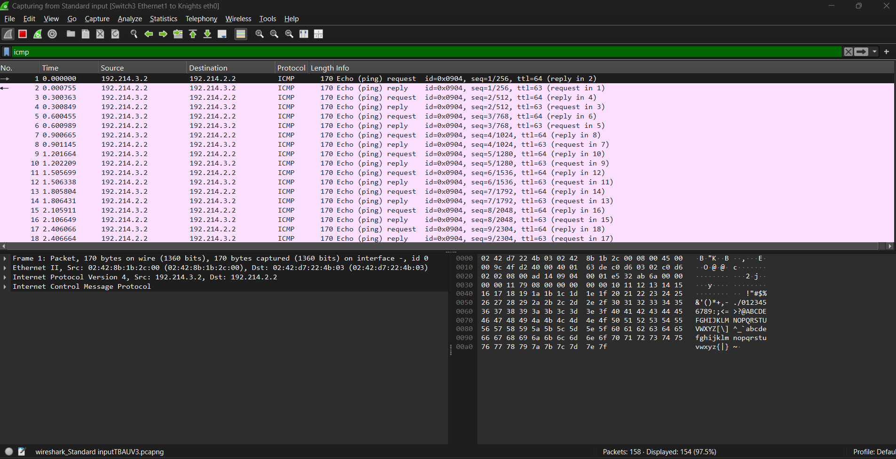


Hasil capture menunjukkan adanya dua jenis paket utama, yaitu Echo Request dan Echo Reply.

Pada paket Echo Request, Knights mengirimkan permintaan ICMP menuju Chisa. Paket tersebut memiliki nilai:

```text
ICMP Type: 8
Code: 0
Source: 192.214.3.2
Destination: 192.214.2.2
```

ICMP Type 8 menunjukkan bahwa paket merupakan Echo Request, sedangkan Code 0 menunjukkan bahwa paket tersebut menggunakan kode standar untuk Echo Request.

Sebaliknya, ketika Chisa menerima request tersebut, Chisa memberikan balasan kepada Knights dalam bentuk Echo Reply dengan nilai:

```text
ICMP Type: 0
Code: 0
Source: 192.214.2.2
Destination: 192.214.3.2
```

ICMP Type 0 menunjukkan bahwa paket merupakan Echo Reply, sedangkan Code*0 merupakan kode standar untuk Echo Reply.

Command yang digunakan menentukan ukuran payload ICMP sebesar 128 bytes melalui parameter `-s 128`. Pada hasil `ping`, sistem menampilkan:

```text
136 bytes from 192.214.2.2
```

Nilai 136 bytes tersebut merupakan gabungan dari 128 bytes payload ICMP dan 8 bytes header ICMP. Dengan demikian, ukuran payload yang dikirim sesuai dengan konfigurasi pengujian, yaitu 128 bytes.

Berdasarkan pengujian dan hasil packet capture Wireshark, koneksi antara Knights (`192.214.3.2`) dan Chisa (`192.214.2.2`) berhasil berjalan dengan baik selama pengiriman 77 paket ICMP. Seluruh paket mendapatkan response sehingga diperoleh 0% packet loss. RTT yang tercatat memiliki nilai minimum 0,272 ms, rata-rata 0,570 ms, dan maksimum 1,273 ms. Pada Wireshark, paket Echo Request teridentifikasi dengan Type 8, Code 0, sedangkan Echo Reply memiliki Type 0, Code 0.

### 11 - Pembuktian Kelemahan Protokol Telnet

Buktikan kelemahan protokol Telnet dengan membuat akun phantom_user dan password wired_ghost pada layanan telnetd di node Chisa. Lakukan login Telnet dari node Eiri ke node Chisa dan tangkap sesi menggunakan Wireshark. Tunjukkan kredensial plain text melalui fitur Follow TCP Stream, serta jelaskan mengapa setiap karakter terkirim dalam paket TCP terpisah.

Pertama-tama, dilakukan setup layanan Telnet Server pada node Chisa dengan meng-install package `busybox-extras` yang menyediakan utilitas `telnetd`.

```bash
apk update
apk add busybox-extras
```

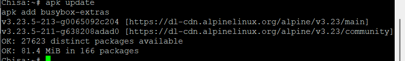

Selanjutnya, dibuat akun `phantom_user` yang akan digunakan untuk melakukan autentikasi melalui layanan Telnet. Password yang digunakan adalah` wired_ghost`.

```bash
adduser -D phantom_user
echo "phantom_user:wired_ghost" | chpasswd
```

Setelah akun berhasil dibuat, layanan Telnet dijalankan pada port 23 menggunakan command berikut:

```bash
telnetd -p 23
```
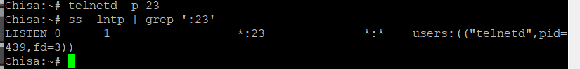

Command tersebut menjalankan Telnet daemon (`telnetd`) pada port TCP 23 sehingga node Chisa dapat menerima koneksi Telnet dari node lain dalam jaringan. Dengan demikian, Chisa telah berfungsi sebagai Telnet Server yang dapat diakses oleh client.

Selanjutnya, dilakukan pengujian koneksi dari node Eiri menuju node Chisa menggunakan layanan Telnet.

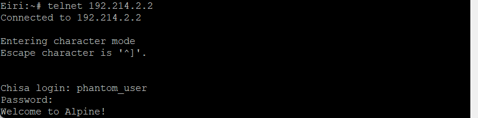
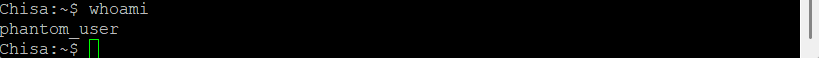

Dari hasil pengujian tersebut, Eiri berhasil terhubung ke Telnet Server pada Chisa dan melakukan login menggunakan akun `phantom_user` dengan password `wired_ghost`. Setelah proses autentikasi berhasil, Eiri memperoleh shell pada node Chisa, yang menunjukkan bahwa koneksi Telnet telah berhasil dilakukan.

Saat Eiri melakukan koneksi Telnet ke Chisa, dilakukan packet capture menggunakan Wireshark. Untuk menyaring traffic yang berkaitan dengan layanan Telnet, digunakan display filter `tcp.port == 23`.

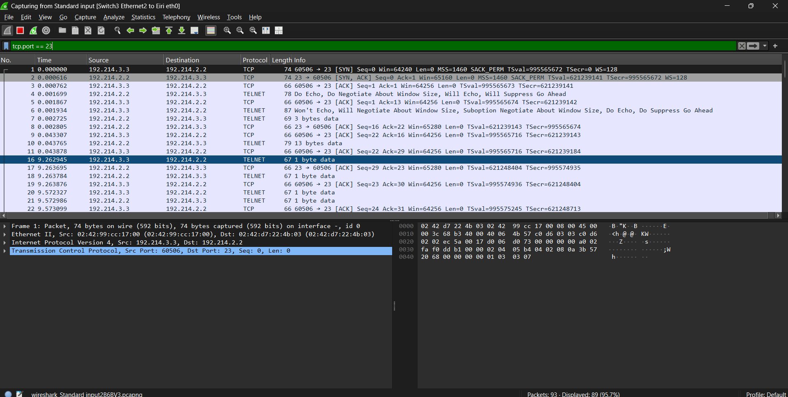

Selanjutnya, salah satu paket Telnet yang terdeteksi dipilih untuk dianalisis. Pada pengujian ini digunakan packet nomor 38. Kemudian, isi komunikasi dianalisis menggunakan fitur Follow TCP Stream pada Wireshark.

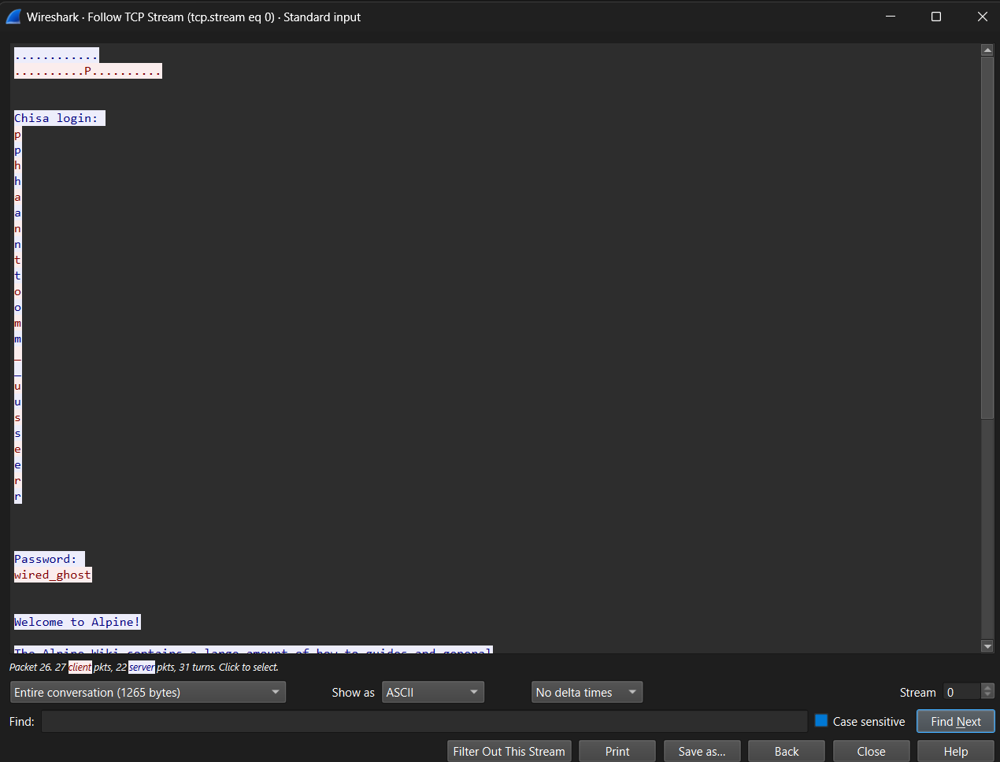

Hasil analisis menunjukkan bahwa informasi yang dikirim melalui sesi Telnet dapat terlihat dalam bentuk plaintext. Username `phantom_user` dan `password wired_ghost` dapat ditemukan pada hasil komunikasi tersebut. Bahkan, karakter username terlihat dikirim secara bertahap dalam paket-paket TCP berukuran kecil.

Hal tersebut menunjukkan kelemahan utama protokol Telnet, yaitu komunikasi antara client dan server tidak dienkripsi. Akibatnya, pihak yang dapat melakukan packet sniffing pada jalur komunikasi berpotensi memperoleh informasi sensitif seperti username dan password.
ter juga dapat berada dalam satu segmen TCP tergantung proses buffering dan pengiriman data.

Dengan demikian, hasil pengujian membuktikan bahwa kredensial Telnet dapat diperoleh melalui packet capture karena data autentikasi dikirim dalam plaintext. Hal ini membuat Telnet tidak sesuai digunakan untuk komunikasi yang membutuhkan kerahasiaan data.


### 12 - Port Scan

Untuk mensimulasikan kondisi beberapa layanan yang berjalan pada node Knights, terlebih dahulu dibuat koneksi listening pada port 22 dan 80 menggunakan Netcat. Kedua port tersebut digunakan untuk merepresentasikan layanan yang berada dalam keadaan terbuka, sedangkan port 7777 dibiarkan tanpa service sehingga berada dalam keadaan tertutup.

Untuk mensimulasikan kondisi beberapa layanan yang berjalan pada node Knights, terlebih dahulu dibuat koneksi listening pada port 22 dan 80 menggunakan Netcat. Kedua port tersebut digunakan untuk merepresentasikan layanan yang berada dalam keadaan terbuka, sedangkan port 7777 dibiarkan tanpa service sehingga berada dalam keadaan tertutup.

Pada node Knights, command berikut dijalankan.

```bash
nohup sh -c "nc -lvkp 22 & nc -lvkp 80 &" > /tmp/test.out 2>&1 &
```

Command tersebut menjalankan Netcat sebagai listener pada port 22 dan 80 secara background. Opsi `-l` digunakan untuk menjalankan Netcat dalam mode listening, `-v` untuk menampilkan informasi koneksi secara verbose, `-k` agar listener tetap berjalan setelah menerima koneksi, sedangkan `-p `digunakan untuk menentukan nomor port. `nohup` digunakan agar proses tetap berjalan ketika shell ditutup, sementara tanda `& `menjalankan proses secara background.

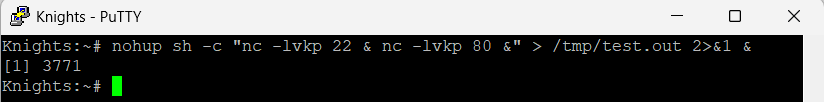

Setelah port 22 dan 80 berada dalam kondisi listening, dilakukan pemindaian dari node Alice menggunakan Netcat dengan command berikut:

```bash
nc -vz 192.214.3.2 22
nc -vz 192.214.3.2 80
nc -vz 192.214.3.2 7777
```

IP 192.214.3.2 merupakan alamat IP node Knights. Opsi `-z` digunakan untuk melakukan pemeriksaan port tanpa mengirimkan data aplikasi, sedangkan `-v `digunakan untuk menampilkan hasil pemeriksaan secara detail.

Hasil pemindaian yang diperoleh adalah:

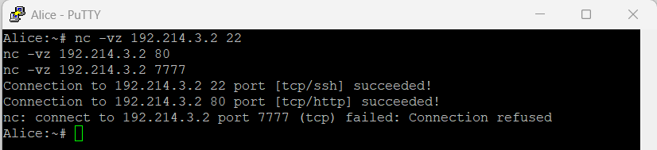

Berdasarkan hasil tersebut, port 22 dan 80 berada dalam keadaan terbuka, ditunjukkan oleh pesan `succeeded!` yang berarti Alice berhasil melakukan koneksi TCP ke kedua port tersebut. Sementara itu, port 7777 berada dalam keadaan tertutup, ditunjukkan oleh pesan` Connection refused` karena tidak terdapat layanan yang menerima koneksi pada port tersebut.

Setelah melakukan pemindaian port dari node Alice menuju node Knights, dilakukan analisis packet capture menggunakan Wireshark dengan display filter:

```text
tcp.port == 22 || tcp.port == 80 || tcp.port == 7777
```

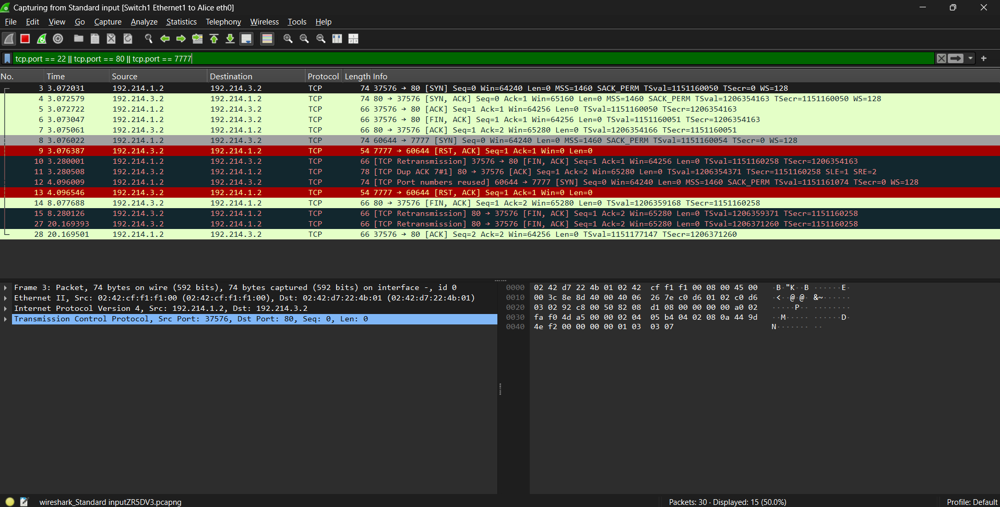

Hasil filter menampilkan 15 dari total 30 paket. Traffic yang terdeteksi berasal dari Alice (`192.214.1.2`) menuju Knights (`192.214.3.2`).

- Port 80

Pada port 80 terlihat proses three-way handshake sebagai berikut:

```text
Packet 3: Alice → Knights   [SYN]       37576 → 80
Packet 4: Knights → Alice   [SYN, ACK]  80 → 37576
Packet 5: Alice → Knights   [ACK]       37576 → 80
```

Respons `SYN, ACK` dari Knights menunjukkan bahwa port 80 berada dalam keadaan terbuka dan terdapat layanan yang menerima koneksi pada port tersebut. Setelah handshake selesai, Alice langsung mengakhiri koneksi dengan mengirimkan `FIN, ACK` tanpa melakukan pertukaran data HTTP.

Pada capture juga terlihat beberapa retransmission pada proses penutupan koneksi. Hal tersebut menunjukkan adanya paket ACK yang tidak segera diterima atau tidak terlihat dalam capture, sehingga salah satu sisi melakukan pengiriman ulang paket `FIN, ACK`.

- Port 7777

Untuk port 7777, pola komunikasi yang terlihat adalah:

```text
Packet 8:  Alice → Knights   [SYN]      60644 → 7777
Packet 9:  Knights → Alice   [RST, ACK] 7777 → 60644

Packet 12: Alice → Knights   [SYN]      60644 → 7777
Packet 13: Knights → Alice   [RST, ACK] 7777 → 60644
```

Berbeda dengan port 80, Knights tidak memberikan `SYN, ACK`, melainkan langsung memberikan `RST, ACK`. Respons tersebut menunjukkan bahwa koneksi TCP ke port 7777 ditolak dan port tersebut berada dalam keadaan tertutup.

Pola ini sesuai dengan hasil pemindaian Netcat sebelumnya yang menghasilkan pesan `Connection refused` ketika Alice mencoba mengakses port 7777.

Port 22

Tidak terdapat paket dengan port 22 pada hasil capture. Oleh karena itu, berdasarkan capture ini hanya dapat disimpulkan bahwa tidak terdapat traffic ke port 22 selama proses capture. Ketiadaan traffic tidak cukup untuk menentukan apakah port 22 terbuka atau tertutup, karena dapat disebabkan oleh proses capture yang tidak merekam koneksi tersebut atau kondisi lain pada saat pengujian.

- Perbedaan TCP Flag

Perbedaan respons TCP antara port terbuka dan port tertutup dapat dirangkum sebagai berikut:

| Kondisi   | Request dari Alice | Response Knights | Makna         |
| --------- | ------------------ | ---------------- | ------------- |
| Port 80   | `SYN`              | `SYN, ACK`       | Port terbuka  |
| Port 7777 | `SYN`              | `RST, ACK`       | Port tertutup |

Pada port terbuka, `SYN, ACK` menunjukkan bahwa target menerima permintaan pembentukan koneksi TCP dan siap melanjutkan proses handshake. Sebaliknya, `RST, ACK` menunjukkan bahwa koneksi tidak dapat dibentuk pada port tersebut, yang pada pengujian ini sesuai dengan kondisi port 7777 yang tidak memiliki layanan listening.

Berdasarkan hasil pemindaian Netcat dan packet capture Wireshark, port 80 berhasil diakses dan menunjukkan respons `SYN, ACK`, sedangkan port 7777 memberikan respons `RST, ACK` dan menghasilkan `Connection refused`.

### 13 - Instalasi SSH

Lain memerintahkan agar administrasi jarak jauh menggunakan SSH secara aman tanpa password. Install OpenSSH server pada node Knights, buat pasangan kunci SSH (ssh-keygen) pada node Mika untuk user `mika_admin`, dan konfigurasikan public key authentication (`PasswordAuthentication no`). Lakukan koneksi SSH dari node Mika ke node Knights, tangkap sesi menggunakan Wireshark, identifikasi paket Protocol Version Exchange dan Key Exchange, serta jelaskan mengapa kredensial tidak terlihat dalam bentuk teks terbuka seperti pada Telnet.

Pertama-tama dilakukan instalasi OpenSSH pada node Knights.

```bash
apk update
apk add openssh
```
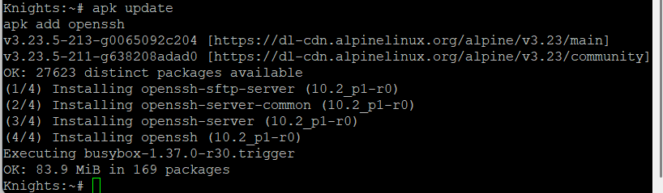

Selanjutnya dibuat user `mika_admin` pada node Knights sebagai user yang akan digunakan untuk menerima koneksi SSH. Host key untuk SSH server juga dibuat menggunakan `ssh-keygen -A`.

```bash
adduser -D mika_admin
ssh-keygen -A
```
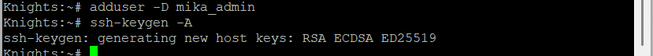

Untuk memastikan akun tidak terkunci dapat digunakan oleh SSH, buat password lokal untuk akun tersebut:

```bash
passwd mika_admin
```
Password ini hanya digunakan untuk memastikan akun `mika_admin` tidak terkunci. Pada konfigurasi SSH selanjutnya, `PasswordAuthentication` akan dinonaktifkan sehingga password tidak digunakan untuk login SSH.

Kemudian dilakukan konfigurasi SSH pada file `/etc/ssh/sshd_config`. Konfigurasi berikut mengaktifkan autentikasi menggunakan public key dan menonaktifkan autentikasi menggunakan password.

```
echo 'PubkeyAuthentication yes' >> /etc/ssh/sshd_config
echo 'PasswordAuthentication no' >> /etc/ssh/sshd_config
```

Konfigurasi `PubkeyAuthentication yes` memungkinkan server menerima autentikasi menggunakan pasangan private key dan public key. Sementara itu, `PasswordAuthentication no` menonaktifkan autentikasi menggunakan password. Dengan demikian, user harus memiliki private key yang sesuai dengan public key yang telah didaftarkan pada server.

SSH server kemudian dijalankan menggunakan:

```
/usr/sbin/sshd
```

Untuk memastikan SSH server telah berjalan dan port 22 dalam keadaan listening, dilakukan pengecekan menggunakan:.

```
ss -lntp | grep ':22'
```

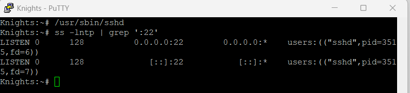

Setelah SSH server pada Knights siap, dilakukan pembuatan pasangan kunci SSH pada node Mika. Pada konfigurasi ini tidak dibuat user `mika_admin` pada Mika karena `mika_admin` merupakan user yang berada pada server Knights. Node Mika menggunakan user yang sedang aktif, yaitu root, untuk menyimpan pasangan kunci SSH pada direktori `/root/.ssh`.

Pertama-tama dibuat direktori .ssh pada home directory user yang sedang aktif.

```
mkdir -p ~/.ssh
chmod 700 ~/.ssh
```

Selanjutnya dibuat pasangan kunci SSH menggunakan algoritma `Ed25519`.

```bash
ssh-keygen -t ed25519 -f ~/.ssh/id_ed25519
```

Pada proses ssh-keygen, lokasi penyimpanan key ditentukan pada `~/.ssh/id_ed25519`. Karena Mika menggunakan user root, lokasi tersebut mengarah ke:

```bash
/root/.ssh/id_ed25519
```

Passphrase dikosongkan dengan menekan Enter sehingga private key dapat digunakan tanpa memasukkan passphrase tambahan ketika melakukan koneksi SSH.

Hasil pembuatan key terdiri dari dua file, yaitu:

- `id_ed25519`: private key yang harus dijaga kerahasiaannya dan tidak boleh diberikan kepada pihak lain.
- `id_ed25519.pub`:  public key yang dapat didaftarkan pada server SSH.

Permission file key kemudian diatur agar private key hanya dapat diakses oleh user yang membuatnya.

```bash
chmod 600 ~/.ssh/id_ed25519
chmod 644 ~/.ssh/id_ed25519.pub
```

Dengan konfigurasi tersebut, direktori .ssh hanya dapat diakses oleh owner, private key hanya dapat dibaca dan ditulis oleh owner, sedangkan public key dapat dibaca oleh user lain apabila diperlukan.

Pada direktori /root/.ssh terdapat dua file hasil pembuatan pasangan kunci SSH.

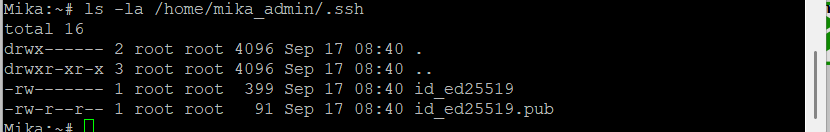


Selanjutnya public key dari Mika ditampilkan untuk didaftarkan pada server Knights.

```bash
cat /home/mika_admin/.ssh/id_ed25519.pub
```
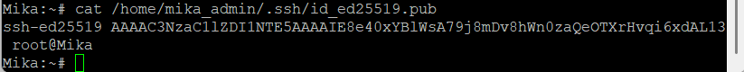

Public key tersebut kemudian disalin secara keseluruhan dan digunakan sebagai public key yang diizinkan untuk user `mika_admin` pada node Knights.

Pada node Knights dibuat direktori `.ssh` untuk user mika_admin.

```bash
mkdir -p /home/mika_admin/.ssh
chmod 700 /home/mika_admin/.ssh
```
Kemudian dibuat file `authorized_keys` yang digunakan SSH server untuk menyimpan daftar public key yang diizinkan melakukan autentikasi.

```bash
nano /home/mika_admin/.ssh/authorized_keys
```

Public key yang diperoleh dari node Mika kemudian ditempelkan ke dalam file authorized_keys.

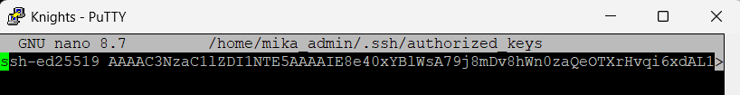

Setelah public key dimasukkan, permission dan ownership file diatur agar sesuai dengan user `mika_admin`.

```bash
chmod 600 /home/mika_admin/.ssh/authorized_keys 
chown -R mika_admin:mika_admin /home/mika_admin/.ssh
```

Selain itu, permission dan ownership home directory `mika_admin` juga disesuaikan untuk memastikan pemeriksaan `StrictModes SSH` tidak menolak file autentikasi.

```
chmod 755 /home/mika_admin
chown mika_admin:mika_admin /home/mika_admin
```

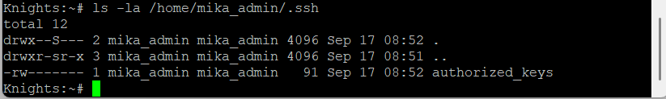


Terakhir, dilakukan koneksi SSH dari node Mika menuju node Knights menggunakan private key yang telah dibuat sebelumnya.

```bash
ssh -i /home/mika_admin/.ssh/id_ed25519 mika_admin@192.214.3.2
```

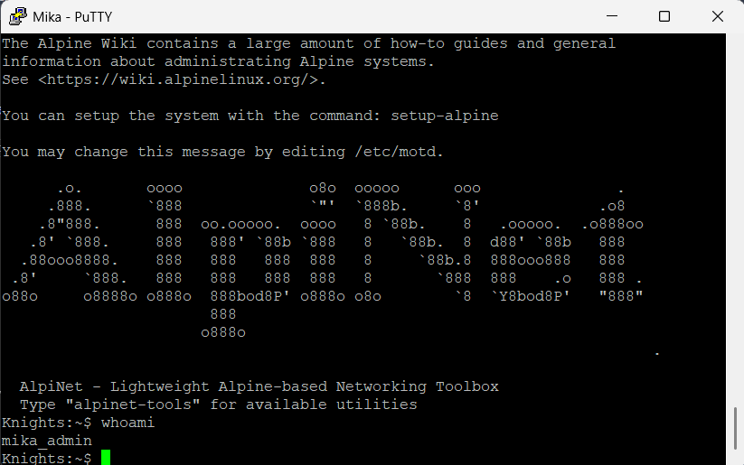

Koneksi tersebut menggunakan private key pada node Mika untuk membuktikan identitas user mika_admin. Karena public key yang sesuai telah terdaftar pada authorized_keys di Knights dan autentikasi password dinonaktifkan, proses login dapat dilakukan tanpa mengirimkan password.

Untuk memverifikasi proses komunikasi SSH secara lebih mendalam, dilakukan capture paket menggunakan Wireshark pada interface GNS3 yang membawa traffic antara node Mika (192.214.1.3) dan node Knights (192.214.3.2). Capture dilakukan sebelum koneksi SSH dijalankan, kemudian koneksi SSH diinisiasi dari node Mika menggunakan perintah:

```bash
ssh -i /home/mika_admin/.ssh/id_ed25519 mika_admin@192.214.3.2
```

Filter tcp.port == 22 diterapkan pada Wireshark untuk menyaring hanya paket yang berkaitan dengan sesi SSH.

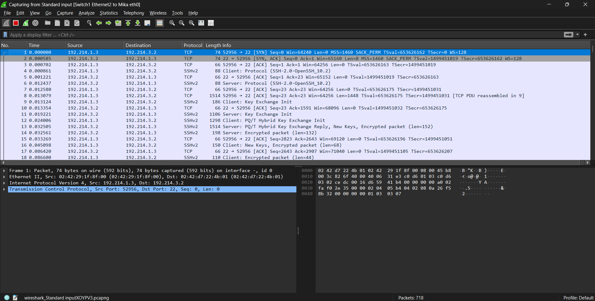

Pada hasil capture, teridentifikasi dua paket awal yang merupakan bagian dari tahap Protocol Version Exchange, yaitu paket No. 4 dan No. 6.

- Paket No. 4: Mika (192.214.1.3) -> Knights (192.214.3.2), dengan informasi `Client: Protocol (SSH-2.0-OpenSSH_10.2)`
- Paket No. 6: Knights (192.214.3.2) -> Mika (192.214.1.3), dengan informasi `Server: Protocol (SSH-2.0-OpenSSH_10.2)`

Pada tahap ini, client dan server saling mengumumkan versi protokol SSH yang digunakan. Informasi versi protokol dikirim sebelum enkripsi sesi terbentuk sehingga masih dapat terbaca. Kedua node menggunakan versi `SSH-2.0-OpenSSH_10.2.`

Setelah Protocol Version Exchange, proses berlanjut ke tahap Key Exchange. Paket yang teridentifikasi adalah:

- Paket No. 9: Mika (192.214.1.3) -> Knights (192.214.3.2), dengan informasi `Client: Key Exchange Init`
- Paket No. 11: Knights (192.214.3.2) ->Mika (192.214.1.3), dengan informasi `Server: Key Exchange Init`

Pada tahap Key Exchange Init, client dan server saling bertukar daftar algoritma kriptografi yang didukung untuk melakukan negosiasi. Negosiasi ini mencakup algoritma key exchange, enkripsi, MAC, dan kompresi yang akan digunakan selama sesi berlangsung.

Untuk membuktikan bahwa kredensial tidak dikirimkan dalam bentuk teks terbuka, dilakukan inspeksi menggunakan fitur Follow TCP Stream pada Wireshark dengan mengklik kanan salah satu paket SSH dan memilih Follow → TCP Stream.

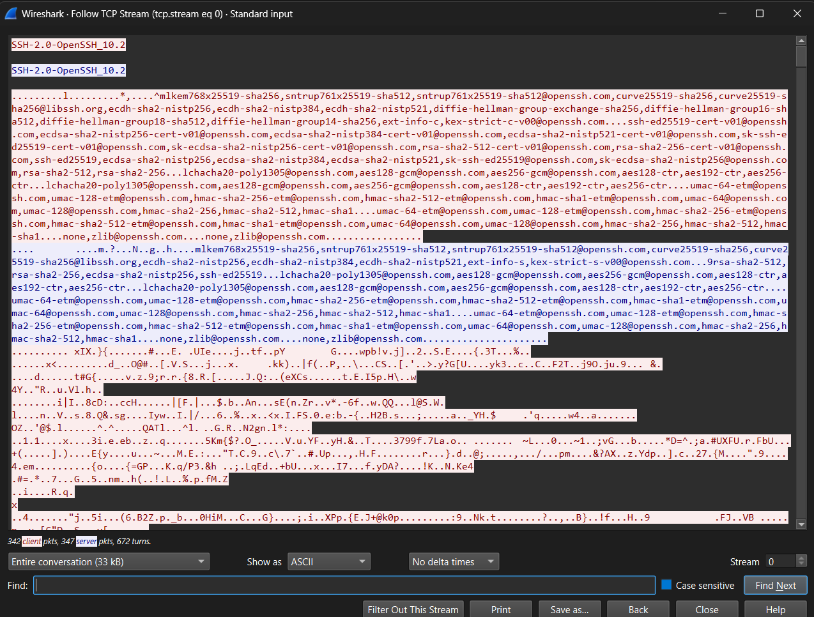

Dari hasil Follow TCP Stream, terlihat dua bagian yang berbeda:

Pada bagian awal, terdapat informasi yang masih dapat terbaca, yaitu:

```bash
SSH-2.0-OpenSSH_10.2
SSH-2.0-OpenSSH_10.2
```
Bagian ini merupakan Protocol Version Exchange yang memang terjadi sebelum enkripsi sesi terbentuk. Selain itu, terlihat pula daftar algoritma yang dinegosiasikan, seperti `mlkem768x25519-sha256, curve25519-sha256, chacha20-poly1305@openssh.com`, dan `aes256-gcm@openssh.com`. Informasi tersebut merupakan parameter negosiasi kriptografi, bukan username maupun password.

Setelah proses key exchange selesai, seluruh data sesi terlihat sebagai karakter acak dan tidak dapat dibaca seperti pada gambar. Hal ini menunjukkan bahwa payload sesi SSH setelah key exchange telah terenkripsi sepenuhnya dan tidak dapat diinterpretasikan melalui packet capture.

Berbeda dengan Telnet yang mengirimkan seluruh data termasuk username dan password dalam bentuk plaintext, SSH tidak menampilkan kredensial apapun yang dapat terbaca pada hasil Follow TCP Stream. Pada konfigurasi ini, autentikasi dilakukan menggunakan mekanisme public key authentication, sehingga password login memang tidak dikirimkan melalui jaringan sama sekali. Mika membuktikan kepemilikan private key `id_ed25519`, sementara Knights memverifikasinya menggunakan public key yang tersimpan di file `authorized_keys`. Proses autentikasi tersebut pun berlangsung di dalam saluran komunikasi yang telah terenkripsi, sehingga tidak dapat diamati melalui packet capture.


### 14 - DDoS

Setelah gagal mengakses FTP, Eiri melancarkan serangan brute-force terhadap form login web Alice. Analisis file capture wired_bruteforce.pcapng untuk mengidentifikasi alamat IP penyerang, target IP beserta port yang diserang, password user lain_admin yang berhasil ditembus, serta web server software dan versi yang dilaporkan pada response header.

Pertama - tama, file dibuka di wireshark. Untuk mengidentifikasi aktivitas login, diterapkan display filter berikut:

```bash
frame contains "Login"
```

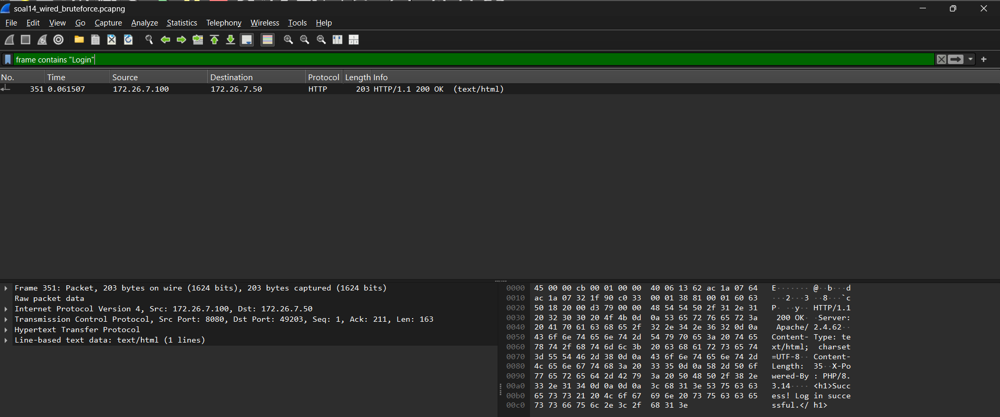

Dari hasil filter, teridentifikasi bahwa:

- IP Penyerang: 172.26.7.50
- IP Target: 172.26.7.100
- Port Target: 8080


Paket tersebut kemudian Salah satu paket kemudian diklik kanan dan dipilih Follow → TCP Stream untuk melihat isi lengkap komunikasi HTTP.

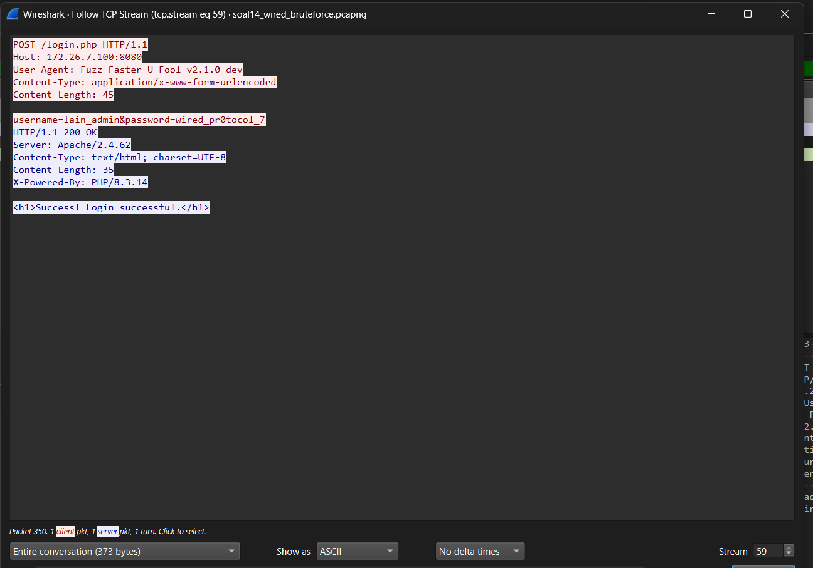

Berikut adalah isi paket:

```bash
POST /login.php HTTP/1.1
Host: 172.26.7.100:8080
User-Agent: Fuzz Faster U Fool v2.1.0-dev
Content-Type: application/x-www-form-urlencoded
Content-Length: 45

username=lain_admin&password=wired_pr0tocol_7
HTTP/1.1 200 OK
Server: Apache/2.4.62
Content-Type: text/html; charset=UTF-8
Content-Length: 35
X-Powered-By: PHP/8.3.14

<h1>Success! Login successful.</h1>
```
Dari TCP Stream tersebut ditemukan informasi berikut:

- Username: lain_admin
- Password: wired_pr0tocol_7
- Web Server: Apache/2.4.62


Berikut adalah validasi jika jawaban sudah benar:

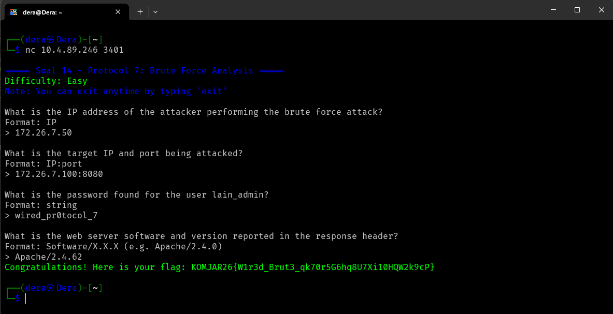

### 15 - 

### 16 - FTP Theft

Eiri meletakkan file malware di server. Dari file capture wired_ftp_theft.pcap, lakukan analisis lalu lintas FTP untuk mengidentifikasi alamat IP server FTP penyerang, banner software FTP yang digunakan, kredensial login penyerang, serta ukuran (size in bytes) dari file malware knights_payload.exe yang diunduh.

Pertama - tama, file di-downlaod dan dibuka di wireshark.

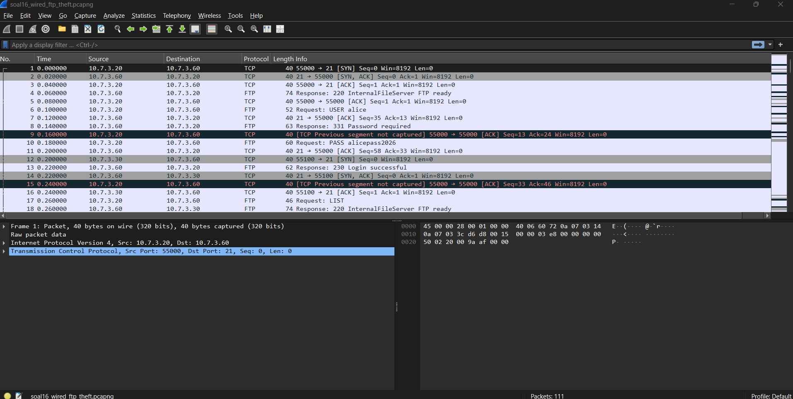
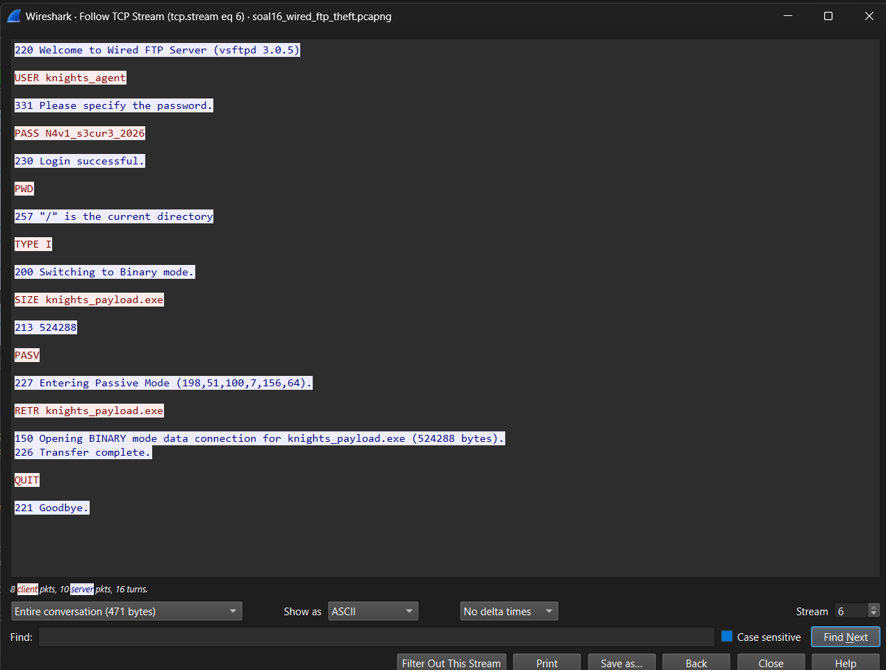

Selanjutnya, dilakukan analisis menggunakan fitur Follow TCP Stream pada packet nomor 90 yang mengandung kata "knights_payload". Hasil analisis menunjukkan adanya proses autentikasi ke FTP Server, kemudian pengunduhan file knights_payload.exe.

Hasil follow TCP Stream:

```bash
220 Welcome to Wired FTP Server (vsftpd 3.0.5)

USER knights_agent

331 Please specify the password.

PASS N4v1_s3cur3_2026

230 Login successful.

PWD

257 "/" is the current directory

TYPE I

200 Switching to Binary mode.

SIZE knights_payload.exe

213 524288

PASV

227 Entering Passive Mode (198,51,100,7,156,64).

RETR knights_payload.exe

150 Opening BINARY mode data connection for knights_payload.exe (524288 bytes).
226 Transfer complete.

QUIT

221 Goodbye.
```

| Pertanyaan | Jawaban  |
| ---------- | -------- |
| IP Server FTP penyerang | 190.51.100.7`|
| Banner software FTP yang digunakan | `vsftpd 3.0.5`|
| Kredensial login penyerang | `USER knights_agent` `PASS N4v1_s3cur3_2026` |
| Ukuran (bytes) file malware `knights_payload.exe` | `524288 bytes` |


Berikut adalah validasi jika jawaban sudah benar:
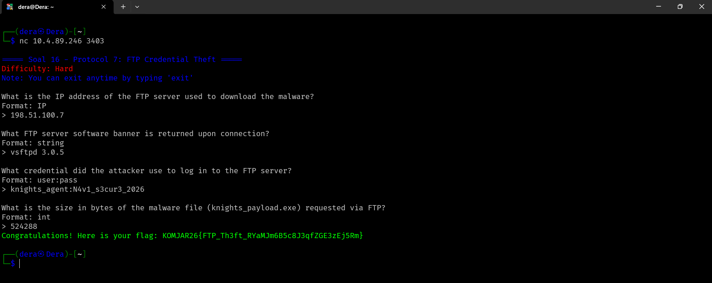

### 17 - HTTP C2
Alice membuat halaman web di node-nya. Eiri memanfaatkan celah untuk mengunduh payload berbahaya ke sistem Alice. Analisis file capture wired_http_c2.pcap untuk mengidentifikasi nama domain (Host) tempat malware diunduh, alamat IP server penyerang, nama file executable malware yang diunduh, serta kode status HTTP yang dikembalikan. 

Pertama - tama, file di-downlaod dan dibuka di wireshark.

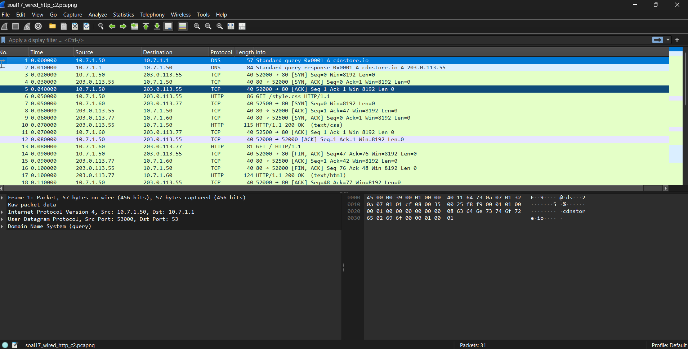
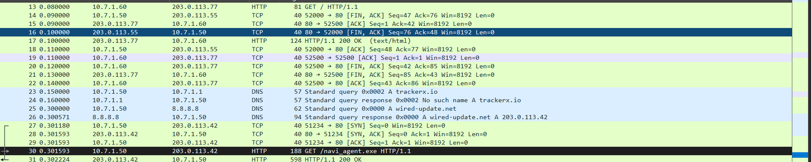

Berdasarkan analisis dari gambar, diperoleh hasil sebagai berikut:

| Pertanyaan | Jawaban |
|------------|---------|
| Nama domain (host) tempat malware diunduh | wired-update.net |
| Alamat IP server penyerang | 203.0.113.42 |
| Nama file exe malware yang diunudh | navi_agent.exe |
| Kode status HTTP yagn dikembalikan | 200 OK|

Berikut adalah validasi jika jawaban sudah benar:
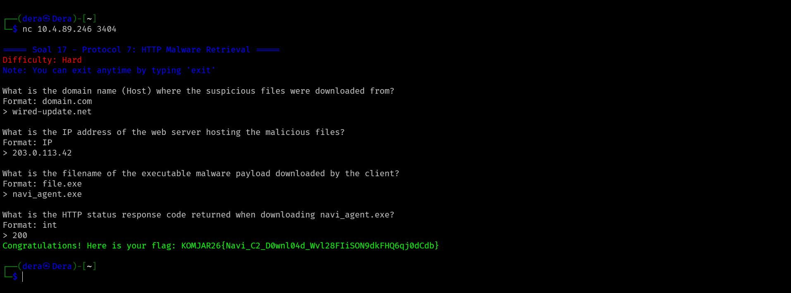

### 18 - SMB Transfer

Eiri mengubah taktik penyerangan dengan menanamkan file malware menggunakan protokol file sharing SMB. Analisis file capture wired_smb_transfer.pcapng untuk mengidentifikasi nama protokol jaringan yang dieksploitasi, IP pengirim dan penerima, folder tujuan penyimpanan malware pada sistem korban, serta nama file executable malware yang ditransfer.

Pertama - tama, file di-downlaod dan dibuka di wireshark.

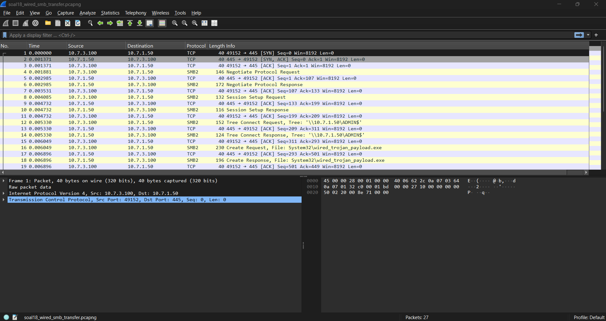
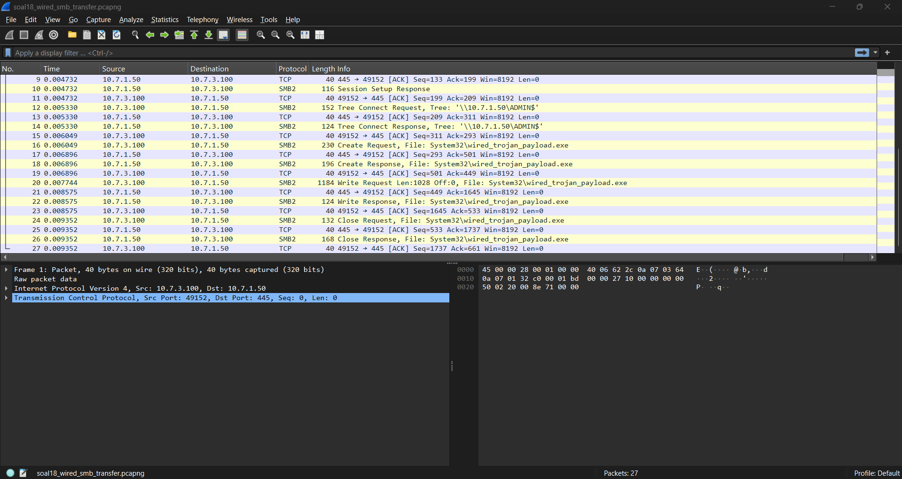

Berdasarkan analisis dari gambar, diperoleh hasil sebagai berikut:

| Pertanyaan | Jawaban |
|------------|---------|
| Nama protokol jaringan yang dieksploitasi | SMB2 |
| IP Pengirim 10.7.3.100|
| IP Penerima |	10.7.1.50|
| Folder tujuan penyimpanan malware pada sistem korban |System32|
| Nama file executable malware yang ditransfer | wired_trojan_payload.exe |

Berikut adalah validasi jika jawaban sudah benar:

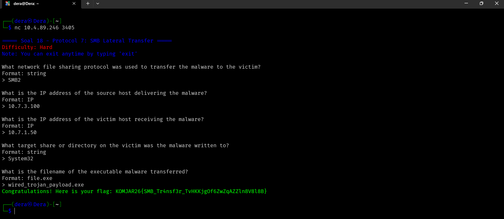

### 19 - SMTP Threat
Eiri meneror jaringan dengan mengirimkan email pemerasan melalui protokol SMTP tanpa enkripsi. Analisis file capture wired_smtp_threat.pcap pada stream TCP terkait, identifikasi alamat email korban yang ditargetkan, password korban yang diklaim bocor oleh penyerang, jenis malware yang diinfeksikan, batas waktu (dalam hari) yang diberikan, serta MailClientID yang tercantum pada pesan.


Pertama - tama, file di-downlaod dan dibuka di wireshark.

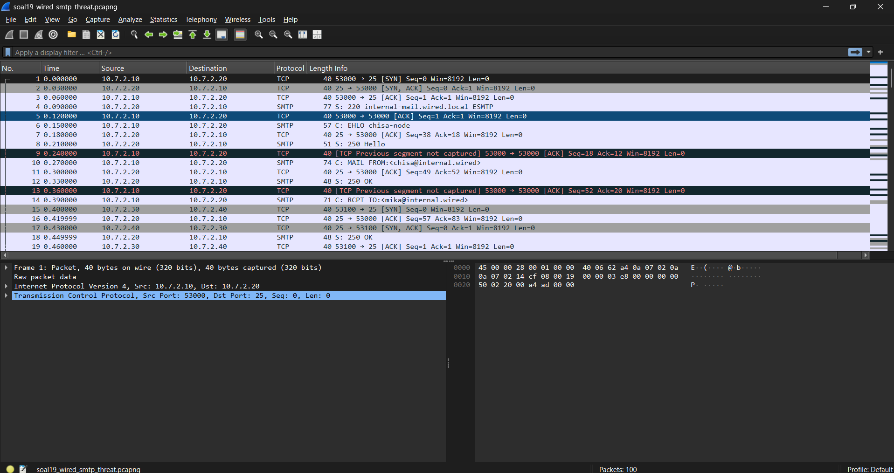
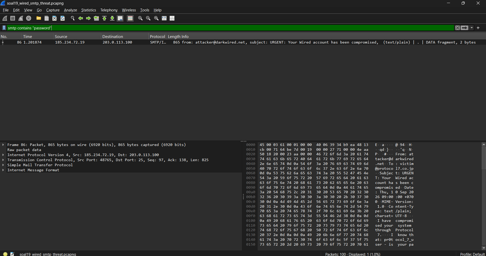
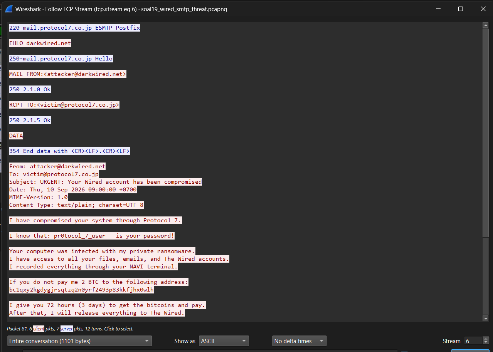

Hasil analisis menggunakan fitur Follow TCP Stream pada packet nomor 86 yang mengandung kata "password":

```bash
220 mail.protocol7.co.jp ESMTP Postfix

EHLO darkwired.net

250-mail.protocol7.co.jp Hello

MAIL FROM:<attacker@darkwired.net>

250 2.1.0 Ok

RCPT TO:<victim@protocol7.co.jp>

250 2.1.5 Ok

DATA

354 End data with <CR><LF>.<CR><LF>

From: attacker@darkwired.net
To: victim@protocol7.co.jp
Subject: URGENT: Your Wired account has been compromised
Date: Thu, 10 Sep 2026 09:00:00 +0700
MIME-Version: 1.0
Content-Type: text/plain; charset=UTF-8

I have compromised your system through Protocol 7.

I know that: pr0tocol_7_user - is your password!

Your computer was infected with my private ransomware.
I have access to all your files, emails, and The Wired accounts.
I recorded everything through your NAVI terminal.

If you do not pay me 2 BTC to the following address:
bc1qxy2kgdygjrsqtzq2n0yrf2493p83kkfjhx0wlh

I give you 72 hours (3 days) to get the bitcoins and pay.
After that, I will release everything to The Wired.

Do not try to contact the Knights. They cannot help you.
Let's all love Lain.

MailClientID: 7719980706
.


250 2.0.0 Ok: queued

QUIT

221 2.0.0 Bye

```

Berdasarkan analisis dari gambar, diperoleh hasil sebagai berikut:

| Pertanyaan | Jawaban |
|------------|---------|
| Alamat email korban | victim@protocol7.co.jp |
| Password korban yang diklaim bocor | pr0tocol_7_user |
| Jenis malware yang diinfeksikan | Ransomware |
| Batas waktu (dalam hari) yang diberikan | 3 |
| MailClientID yang tercantum pada pesan | 7719980706 |

Berikut adalah validasi jika jawaban sudah benar:

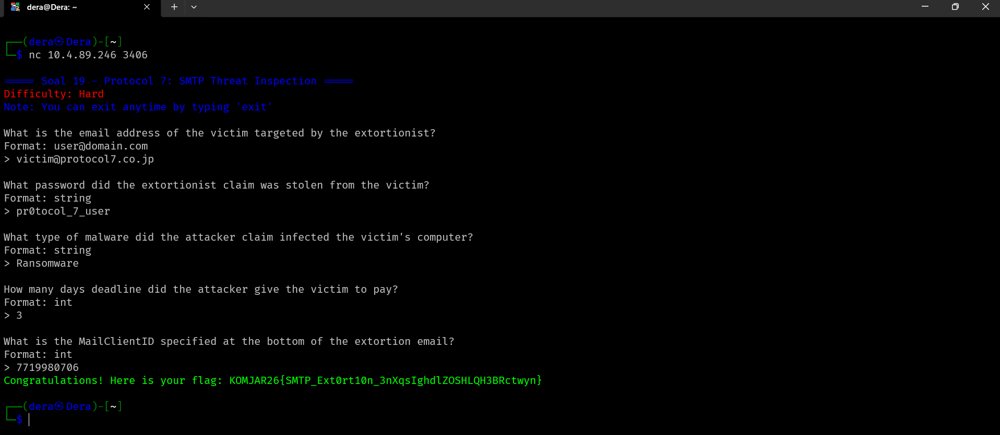

### 20 - TLS Decrypt

Untuk rencana pamungkasnya, Eiri menyembunyikan komunikasi malware di balik saluran terenkripsi TLS. Namun Alice telah menyediakan file keylog untuk mendekripsi lalu lintas data tersebut. Analisis file capture wired_tls_decrypt.pcapng bersama keyslogfile.txt untuk mengidentifikasi versi protokol TLS yang dinegosiasikan, nama domain (SNI) yang diakses, alamat IP server HTTPS penyerang, User-Agent yang digunakan, serta HTTP request method dan path yang tersembunyi di dalam sesi dekripsi.

Pertama-tama, file di-download dan di-unzip. Terdapat dua file di dalamnya, yaitu file capture Wireshark` wired_tls_decrypt.pcapng` dan file kunci `keyslogfile.txt`.

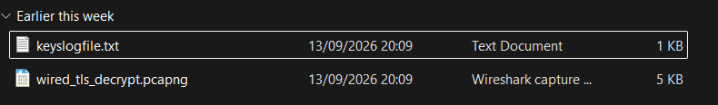

Isi dari file wireshark wired_tls_decrypt.pcapng

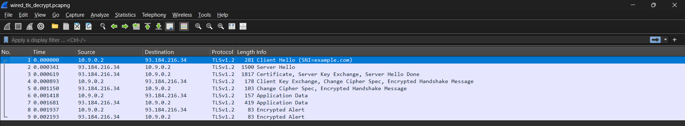

Isi dari file `keyslogfile.txt`

```text
CLIENT_RANDOM f67a28b386b31c620d76c0026fdd9888edbe6bf0f5b715b2caca158f84ae9d66 cc38e78182b9dfd74ef3103d79bbc99cfc9b4dad209ed209062b5481e63353128da7571b13cfd4d3a5ae7d0520fb346d

```
File `keyslogfile.txt` berisi nilai `CLIENT_RANDOM` yang digunakan untuk mendekripsi sesi TLS. Untuk memuat file kunci tersebut ke Wireshark, dilakukan langkah berikut:
Buka Edit -> Preferences -> Protocols -> TLS, kemudian pada field Pre-Master-Secret log filename arahkan ke file keyslogfile.txt dan klik OK.

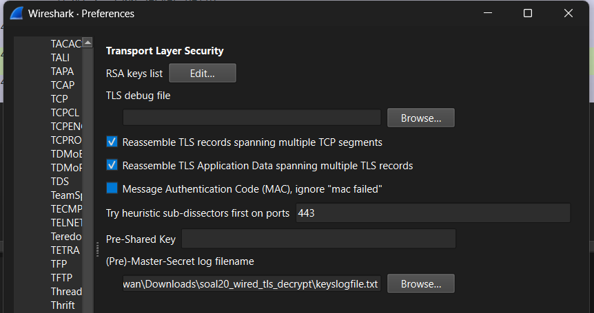


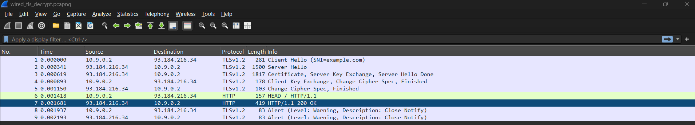

Setelah file kunci dimuat, Wireshark secara otomatis mendekripsi sesi TLS. Paket No. 6 dan No. 7 yang sebelumnya tercatat sebagai Application Data berubah menjadi paket HTTP yang dapat dibaca.

Untuk melihat isi lengkap request dan response HTTP, dilakukan Follow → TLS Stream pada salah satu paket tersebut, sehingga diperoleh informasi berikut:

```bash
HEAD / HTTP/1.1
Host: example.com
User-Agent: curl/7.62.0
Accept: */*


HTTP/1.1 200 OK
Content-Encoding: gzip
Accept-Ranges: bytes
Cache-Control: max-age=604800
Content-Type: text/html; charset=UTF-8
Date: Sat, 17 Nov 2018 14:24:03 GMT
Etag: "1541025663"
Expires: Sat, 24 Nov 2018 14:24:03 GMT
Last-Modified: Fri, 09 Aug 2013 23:54:35 GMT
Server: ECS (dca/24CE)
X-Cache: HIT
Content-Length: 606
```

Berdasarkan analisis, diperoleh hasil sebagai berikut:

| Pertanyaan | Jawaban |
|------------|---------|
| versi protokol TLS yang dinegosiasikan |TLSv1.2|
| nama domain (SNI) yang diakses|example.com |
| IP address server HTTPS| 93.184.216.34|
| User-Agent yang digunakan |curl/7.62.0|
| HTTP request method dan path yang tersembunyi di dalam sesi dekripsi ||


Berikut adalah validasi jika jawaban sudah benar:

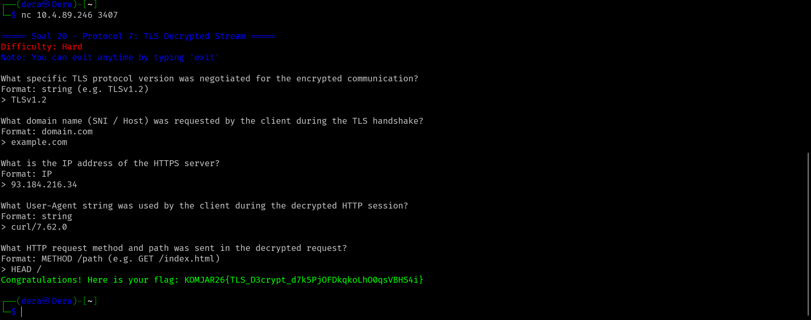
